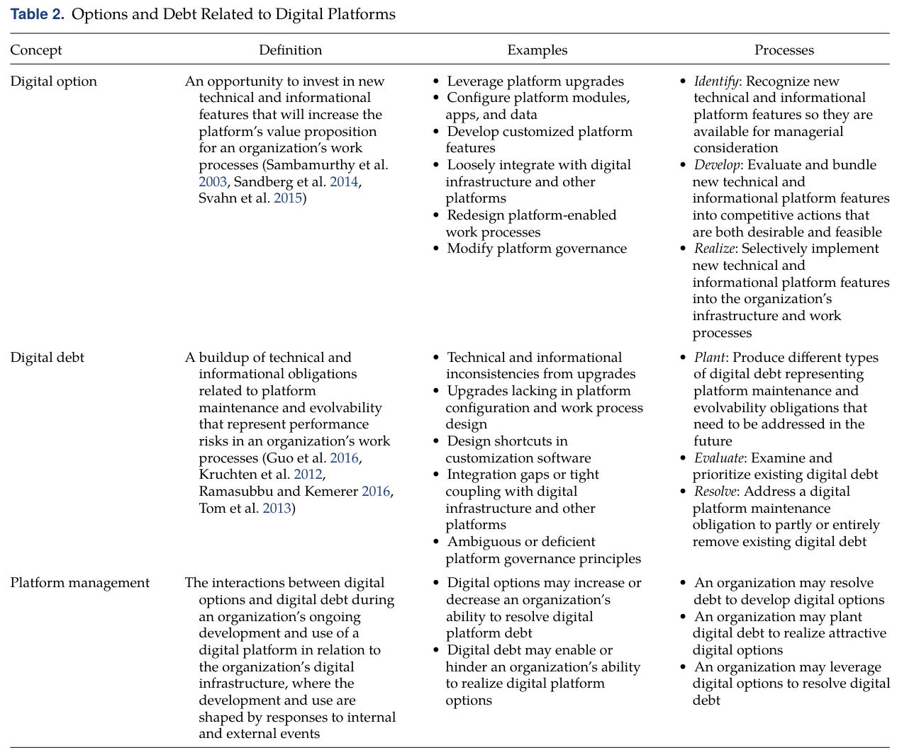
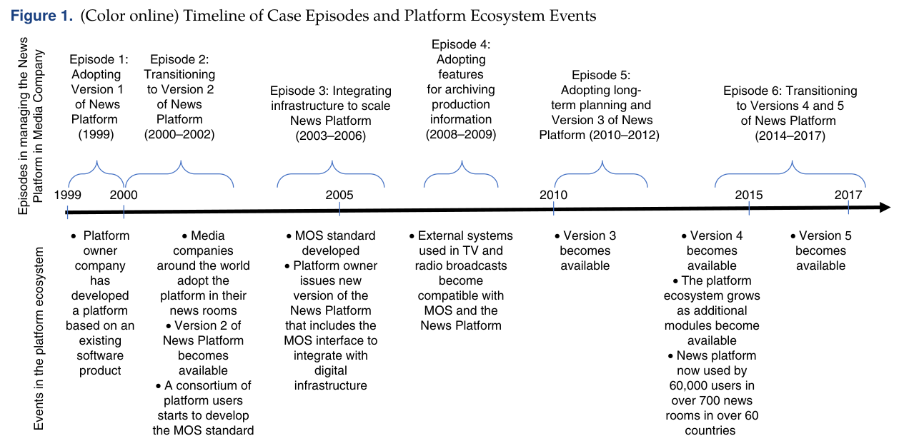
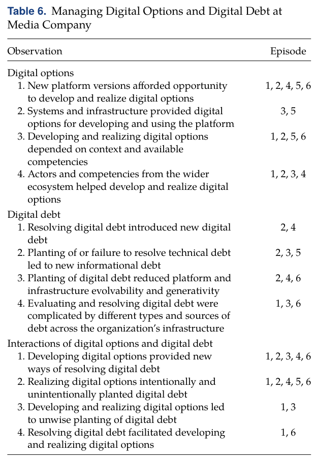

# Rolland, Mathiassen & Rai (2018) – Digital Options og Digital Debt

## Kilde og sidetal

Rolland, K. H., Mathiassen, L. & Rai, A. (2018). *Managing Digital Platforms in User Organizations: The Interactions Between Digital Options and Digital Debt*. Information Systems Research, 29(2), 419–443. DOI: 10.1287/isre.2018.0788.

Henvisninger bruger **artiklens trykte sidetal**. I den uploadede PDF er s. 419 PDF-side 2; PDF-siden findes ved at trække 417 fra det trykte sidetal. Figurer og tabeller er udsnit af kilden; forklaringerne er parafraser.

## 1. Hovedpointen på et minut

En digital platform giver organisationen nye muligheder, men indgår altid i en eksisterende infrastruktur med systemer, data, kompetencer og rutiner. Når organisationen udnytter mulighederne, kan den samtidig skabe forpligtelser, som gør senere vedligeholdelse og udvikling vanskeligere. Forfatterne kalder dette samspillet mellem **digital options** og **digital debt**. (s. 419–420, 424–427)

> [!important] Husk til undervisningen
> Ledelsesopgaven er ikke at udnytte alle muligheder eller undgå al gæld. Den er at forstå, hvilke muligheder der er værdifulde i den konkrete organisation, og hvilken gæld man skaber, overtager eller må afvikle for at realisere dem.

## 2. Perspektivet: brugerorganisationen, ikke kun platformejeren

Artiklen undersøger en organisation, der bruger en eksternt ejet brancheplatform. Det er et andet perspektiv end at spørge, hvordan platformejeren tiltrækker udviklere og opbygger et økosystem. En platform kan være succesfuld på markedet og samtidig være besværlig at integrere i en bestemt organisation. (s. 419–424)

**Digital infrastructure** er organisationens samlede, historisk opbyggede tekniske og organisatoriske sammenhæng: platforme, andre systemer, data, integrationer og arbejdspraksisser. En platform er en del af infrastrukturen – ikke nødvendigvis hele infrastrukturen. (s. 424–427)

**Installed base** betyder den allerede etablerede infrastruktur. Den rummer både ressourcer og begrænsninger. Den er ikke automatisk digital gæld.

Tabel 1 på s. 421 skelner mellem tre platformsperspektiver:

- **Engineering:** Teknisk arkitektur, modularitet og udviklingsmuligheder.
- **Economic:** Markeder, netværkseffekter og værdiskabelse.
- **Organizational:** Samarbejde, styring og relationer mellem aktører.

Forfatterne kombinerer perspektiverne for at forstå den lokale anvendelse over tid.

## 3. Grundbegreberne og deres processer

*Tabel 2, s. 425. Venstre side handler om muligheder for forbedring; højre side om akkumulerede forpligtelser. Processerne er analytiske begreber, ikke en obligatorisk projektmodel.*

### Digital options – muligheder, man kan vælge at realisere

En **digital option** er en mulighed for at investere i tekniske eller informationsmæssige egenskaber, som kan forbedre understøttelsen af arbejdsprocesser. Det er en mulighed, ikke en allerede opnået gevinst eller et krav om at handle. (s. 424–426)

Den kan eksempelvis bestå i en platformopgradering, en integration eller en ændret anvendelse af eksisterende teknologi.

| Proces | Hvad gør organisationen? | Eget eksempel |
| --- | --- | --- |
| **Identify** | Opdager en mulighed. | Ser, at en ny platformversion kan automatisere arkivering. |
| **Develop** | Undersøger og konkretiserer den i forhold til lokale behov og ressourcer. | Afklarer metadata, integration, kompetencer og arbejdsgang. |
| **Realize** | Gennemfører den valgte mulighed i infrastrukturen og arbejdet. | Sætter løsningen i drift og ændrer rutinerne. |

**Develop** betyder altså mere end programmering. En leverandørfunktion er ikke automatisk en brugbar lokal løsning. Organisationen kan også udvikle muligheder gennem egne medarbejdere, eksisterende systemer eller andre aktører i økosystemet. (s. 425–426, 438–439)

### Digital debt – akkumulerede forpligtelser

**Digital debt** er ophobede tekniske og informationsmæssige forpligtelser, der påvirker infrastrukturens vedligeholdelse og videreudvikling og kan belaste arbejdsprocesserne. Gælden kan opstå bevidst eller utilsigtet. En oprindeligt fornuftig beslutning kan blive problematisk, når omgivelserne ændrer sig. (s. 425–427)

- **Technical debt:** Forpligtelser knyttet til tekniske løsninger og afhængigheder, eksempelvis specialintegrationer, der skal ombygges ved opgraderinger.
- **Informational debt:** Forpligtelser knyttet til information, eksempelvis spredte, duplikerede eller inkonsistent kategoriserede data.

Digital gæld er derfor bredere end dårlig kode. Det er heller ikke blot et andet ord for alle it-problemer.

| Proces | Hvad betyder det? | Eget eksempel |
| --- | --- | --- |
| **Plant** | Gæld skabes eller indlejres. | En hurtig integration omgår en stabil grænseflade. |
| **Evaluate** | Gælden afdækkes, vurderes og prioriteres. | Man undersøger, hvilke opgraderinger integrationen blokerer. |
| **Resolve** | Gæld håndteres helt eller delvist. | Integrationen ombygges, og data ryddes op. |

**Maintainability** er, hvor let infrastrukturen kan vedligeholdes. **Evolvability** er, hvor let den kan ændres og videreudvikles. Et system kan fungere i dag, selv om det er blevet svært at udvikle i morgen. (s. 426–427)

## 4. Hvordan påvirker muligheder og gæld hinanden?

Det vigtigste er relationerne mellem begreberne. (s. 438–440)

1. **En mulighed kan løse gæld.** En ny løsning kan erstatte besværlig dobbeltregistrering.
2. **Realisering af en mulighed kan plante ny gæld.** En smart specialløsning kan skabe afhængighed af en bestemt platformversion.
3. **Gæld kan blokere muligheder.** En gammel integration kan forhindre en opgradering.
4. **Gældsafvikling kan åbne muligheder.** Oprydning i data kan gøre nye analyser og integrationer mulige.

> [!example] Thomas-modulet fra casen
> Et modul automatiserede metadatahåndtering i forbindelse med arkivering. Det forbedrede arbejdet, men var tæt koblet til de eksisterende systemer, så ændringer i dem kunne kræve ændringer i modulet. Samme tiltag skabte altså en gevinst og nye tekniske forpligtelser. (s. 435)

Det er for simpelt at sige, at *nyt er godt, gammelt er gæld*. Det afgørende er de konkrete afhængigheder og deres konsekvenser over tid.

## 5. Casen: en medieorganisations platformhistorie

Organisationen omtales anonymt som **Media Company**, systemet som **News Platform** og leverandøren som **Platform Company**. Noten forsøger ikke at identificere dem. Platformen understøtter nyhedsarbejde og indgår i et større miljø af produktions- og arkivsystemer. (s. 429–431)

*Figur 1, s. 432. Øverst ses caseepisoderne; nederst udviklinger i platformens økosystem. Figuren er en tidslinje, ikke et diagram, der alene dokumenterer årsagssammenhænge.*

### De seks episoder

| Periode       | Hvad sker der?                                                                                                                          | Hvad viser det om options/debt?                                                                                       |
| ------------- | --------------------------------------------------------------------------------------------------------------------------------------- | --------------------------------------------------------------------------------------------------------------------- |
| **1999**      | Bekymring om årtusindskiftet bidrager til valg og implementering af en standardplatform.                                                | Tidspres og forbindelser til gamle arkiver giver nye forpligtelser, samtidig med at et presserende problem håndteres. |
| **2000–2002** | Platformen tilpasses nyhedsarbejdet; funktioner anvendes på særlige måder.                                                              | Lokal tilpasning kan skabe inkonsistens og specialfunktioner, som senere skal håndteres.                              |
| **2003–2006** | Integration med andre produktionssystemer udbygges.                                                                                     | Mindre dobbeltarbejde kan følges af tættere koblinger, når løsninger omgår standardgrænseflader.                      |
| **2008–2009** | Thomas-modulet automatiserer dele af arkiveringen.                                                                                      | Informationsarbejdet forbedres, men tekniske afhængigheder skabes.                                                    |
| **2010–2012** | Ønsket langtidsplanlægning kræver en version, organisationen ikke kan opgradere til under kontrakten. Lokale værktøjer bruges i stedet. | Arbejdet kan fortsætte, men information spredes på flere værktøjer.                                                   |
| **2014–2017** | Kontrakt og opgraderingsmuligheder genovervejes; organisationen er allerede dybt afhængig af platformen.                                | En trinvis opgradering åbner muligheder, men integrationer og leverandørfejl komplicerer forløbet.                    |

*Grundlag: tabel 5, s. 430–431, og casebeskrivelsen s. 432–437.*

### To særligt vigtige nuancer

**1. Gæld kan opstå uden ændringer i platformens kerne.** I planlægningsepisoden skaber brugen af flere lokale værktøjer informationsmæssig fragmentering. Det er organisationens samlede infrastruktur og rutiner, der ændres. (s. 436)

**2. Gæld kommer ikke kun fra egne udviklere.** Leverandørens fejl, versioner, kontrakter og produktvalg påvirker organisationens handlemuligheder. Organisationen skal håndtere afhængigheder, den ikke selv kontrollerer. (s. 436–437)

## 6. Artiklens samlede resultater

*Tabel 6, s. 438. Læs først hver kategori for sig og derefter den nederste kategori om samspillet.*

Forfatterne opstiller fire teoretiske propositioner. Her er de i forenklet form, ikke som direkte citater: (s. 439–440)

1. **Muligheder skal konkretiseres i kontekst.** Organisationen bør bruge viden og kompetencer både i økosystemet og i sin egen infrastruktur, når den udvikler og realiserer muligheder.
2. **Gæld kræver løbende vurdering.** Teknisk og informationsmæssig gæld findes på tværs af infrastrukturen og skal vurderes og håndteres iterativt.
3. **Muligheder kan kræve gældsafvikling.** Men hvis organisationen afviser enhver handling, der kan skabe gæld, kan den også afvise attraktive muligheder.
4. **Muligheder kan håndtere gæld – og samtidig skabe mere.** Begejstring for en ny løsning kan føre til uovervejede forpligtelser.

En **proposition** er her et teoretisk udsagn udviklet gennem casen. Det er ikke en statistisk testet universel lov.

## 7. Hvad bør ledelsen gøre?

Artiklen peger på **mindful management**: opmærksom, kontekstfølsom vurdering af både muligheder og følgevirkninger. Ikke blind standardisering og heller ikke ukritisk lokal innovation. (s. 439–441)

Et praktisk sæt spørgsmål, udledt af artiklen:

- Hvilken arbejdsproces forbedrer denne mulighed konkret?
- Hvilke data, integrationer og kompetencer kræver den?
- Hvilken eksisterende gæld må vi håndtere først?
- Hvilken ny gæld accepterer vi, og hvorfor?
- Hvem bliver afhængige af løsningen, og hvem skal vedligeholde den?
- Hvad sker der ved næste opgradering eller leverandørskifte?

Ledelsen kan have brug for at veksle mellem decentral udvikling og mere central koordinering. Lokale initiativer kan opdage gode løsninger, mens fælles koordinering kan være nødvendig for at håndtere ophobede afhængigheder. Artiklen siger ikke, at én styringsform altid er bedst. (s. 441)

## 8. Metode og kritisk læsning

Det er et **fortolkende, longitudinelt casestudie**, der rekonstruerer en udvikling fra 1999 og kombinerer historiske oplysninger med nyere observationer. Forskerne observerede altså ikke selv organisationen kontinuerligt gennem hele perioden. Data omfatter interviews med 24 interessenter, cirka 125 timers observation, dokumenter og en workshop. (s. 427–429)

Forskerne bruger tidsmæssige episoder til at analysere, hvordan tidligere handlinger skaber betingelser for senere udvikling. Analysen veksler mellem teoretisk forståelse og empiriske detaljer.

**Styrke:** Begreberne forbindes med konkrete hændelser over lang tid, også når en løsning får andre konsekvenser end først forventet.

**Begrænsning:** En branche- og organisationsspecifik case giver ikke et statistisk mål for, hvor ofte bestemte mekanismer forekommer. Begreberne kan bruges analytisk i andre organisationer, men deres konkrete betydning skal undersøges dér.

## 9. Lingo – centrale ord på almindeligt dansk

| Begreb | Betydning |
| --- | --- |
| **User organization** | Organisationen, der anvender en platform ejet af en anden. |
| **Digital option** | En mulig investering eller ændring, der kan forbedre arbejdsprocesser. |
| **Digital debt** | Ophobede tekniske og informationsmæssige forpligtelser. |
| **Informational debt** | Problematisk informationsarv, fx inkonsistens, dubletter og fragmentering. |
| **Installed base** | Det allerede etablerede tekniske og organisatoriske udgangspunkt. |
| **Contextualization** | At gøre en generel mulighed relevant og gennemførlig lokalt. |
| **Maintainability** | Hvor let noget kan vedligeholdes. |
| **Evolvability** | Hvor let noget kan videreudvikles. |
| **Generativity** | Evnen til at muliggøre nye anvendelser og bidrag, der ikke alle var planlagt. |
| **Modularity** | At dele kan udvikles og udskiftes gennem afgrænsede grænseflader. |
| **Tight coupling** | Tætte afhængigheder: ændringer ét sted kræver let ændringer andre steder. |
| **Loose coupling** | Mere afgrænsede afhængigheder; delene kan i højere grad ændres hver for sig. |
| **Boundary resources** | Tekniske værktøjer og regulerende rammer for bidrag og forbindelser til platformen. |
| **Interoperability** | At systemer kan arbejde sammen og udveksle information meningsfuldt. |
| **Path dependence** | At tidligere valg præger, hvilke næste valg der er mulige eller realistiske. |
| **Mindful management** | Bevidst vurdering af muligheder, sammenhænge og konsekvenser i den konkrete situation. |

*Begrebsgrundlag: s. 420–427 og 438–441. Ordlisten er en dansk læsehjælp, ikke ordrette definitioner fra artiklen.*

## 10. Kobling til Leonardi – egen faglig sammenligning

Leonardis **imbrication** kan bruges som en supplerende måde at forstå, hvordan rutiner og teknologiske arrangementer opbygges gennem gentagne tilpasninger. Rolland et al. giver et mere specifikt sprog for, hvordan sådan en historik både åbner muligheder og skaber forpligtelser.

Det er en sammenkobling af pensumtekster, ikke en påstand om, at imbrication er denne artikels centrale model. Digital debt er heller ikke blot et synonym for constraints: gæld betegner bestemte akkumulerede forpligtelser, mens en constraint er en oplevet begrænsning i forhold til et mål.

## 11. Tjek din forståelse

1. Hvorfor er en ny funktion ikke automatisk en realiseret digital option?
2. Giv et eksempel på informational debt, som ikke bare er dårlig kode.
3. Hvordan kan samme løsning både afvikle og plante gæld?
4. Hvorfor kan gælden vokse, selv om selve platformen ikke ændres?
5. Hvorfor er målet ikke nødvendigvis nul digital gæld?

**Kort mundtlig opsummering:** Platformledelse i brugerorganisationer handler om et løbende samspil mellem nye muligheder og ophobede tekniske og informationsmæssige forpligtelser. Gevinster og problemer skal vurderes i hele den lokale infrastruktur, ikke alene i leverandørens platform.

## Egne noter fra undervisningen

- Underviserens pointer:
- Mit eget eksempel på options/debt:
- Spørgsmål eller tvivl:

Relateret: [[Staykova-et-al-2019-Generative-Mechanisms]] · [[Laeseguide-Platforme-og-infrastruktur]]
