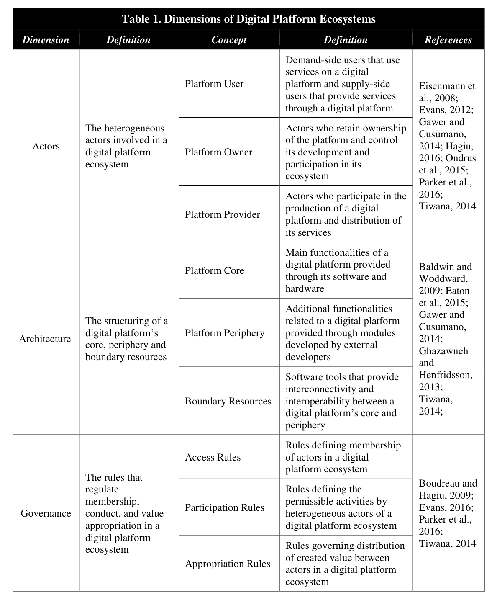
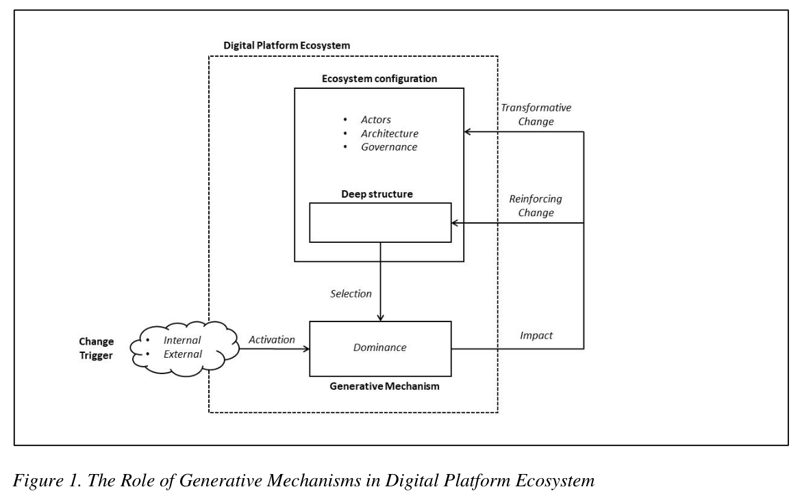
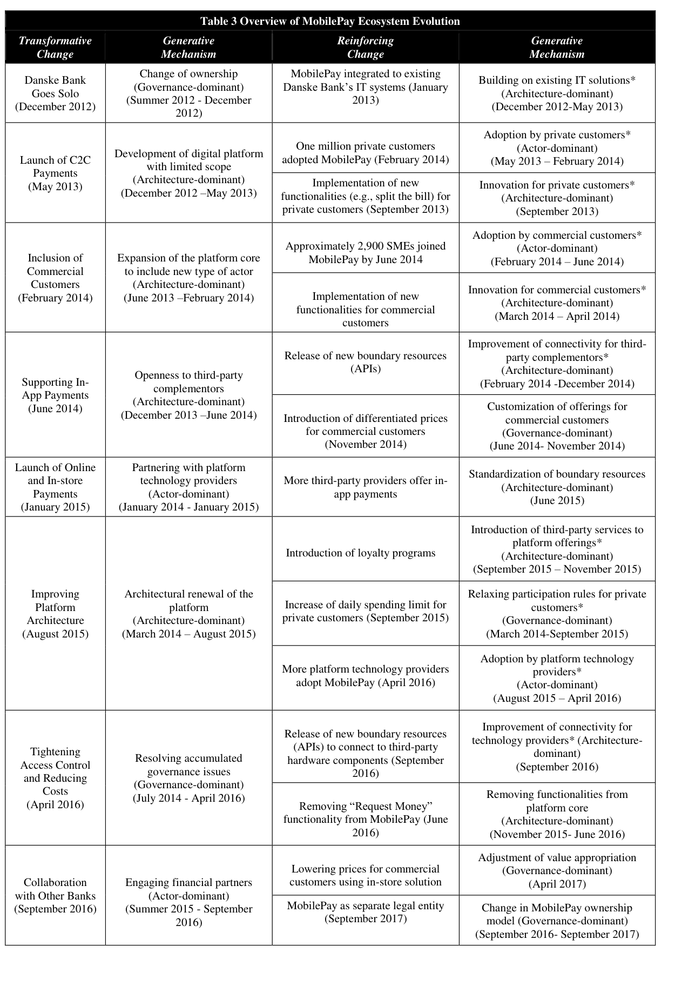

# Staykova et al. (2019) – Generative Mechanisms for Digital Platform Ecosystem Evolution

## Kilde og læsevejledning

Staykova, K., Mathiassen, L., Rai, A. & Damsgaard, J. (2019). *Generative Mechanisms for Digital Platform Ecosystem Evolution: A Punctuated Equilibrium Theory*. Det uploadede **manuskript fra juni 2019** angiver, at det skal indsendes til Information Systems Research. Noten dokumenterer derfor denne version, ikke en verificeret endelig tidsskriftsudgave. Staykova er førsteforfatter i filen, selv om pensumhenvisningen begynder med Mathiassen.

**Sidetal:** Alle henvisninger er PDF-sider, hvor forsiden er side 1. Figurer og tabeller nedenfor er udsnit af den uploadede kilde. Forklaringer og eksempler er parafraser.

## 1. Hovedpointen på et minut

Et digitalt platformsøkosystem udvikler sig ikke bare ved, at ejeren tilføjer funktioner. Udviklingen sker gennem samspillet mellem **aktører, arkitektur og governance**. Interne problemer og eksterne begivenheder kan aktivere mekanismer, der enten fastholder eller ændrer økosystemets grundlæggende struktur. MobilePays udvikling er det empiriske eksempel. (PDF-s. 2–3, 27–28)

Det afgørende er at skelne mellem:

- **Trigger:** Hvad satte noget i gang?
- **Generative mechanism:** Hvilken proces, baseret på økosystemets eksisterende egenskaber, frembragte forandringen?
- **Outcome/impact:** Hvad blev ændret – og blev den grundlæggende struktur bevaret eller omformet?

> [!important] Husk til undervisningen
> Mere aktivitet er ikke nødvendigvis en transformation. Flere brugere kan forstærke den eksisterende platform, mens nye aktørtyper og ændrede adgangsregler kan ændre selve måden, økosystemet fungerer på.

## 2. Hvad består et platformsøkosystem af?

Artiklen samler tre dimensioner, som ofte behandles hver for sig. **Deep structure** er den relativt vedvarende konfiguration af dimensionerne og deres indbyrdes sammenhænge. Det er altså ikke bare platformens kode eller tekniske kerne. (PDF-s. 7–11)

*Tabel 1, PDF-s. 8. Læs tabellen som tre analytiske dimensioner – ikke tre uafhængige systemer.*

### Aktører – hvem deltager, og i hvilke roller?

- **Platform owner:** Ejeren med kontrol over blandt andet deltagelse og udvikling.
- **Platform provider:** Den, som leverer teknologien eller distribuerer platformens ydelser. Ejer og leverandør behøver ikke være samme organisation.
- **Demand-side users:** Brugere, der efterspørger og anvender ydelser.
- **Supply-side users:** Aktører, der leverer ydelser på platformen.

Én organisation kan have flere roller. En platform er derfor ikke kun en relation mellem en leverandør og en slutbruger. (PDF-s. 8–9)

### Arkitektur – hvordan hænger teknologien sammen?

- **Core:** Den grundlæggende tekniske funktionalitet.
- **Periphery:** Supplerende moduler og tjenester omkring kernen.
- **Boundary resources:** Forbindelsesressourcer som API'er og udviklingsværktøjer, der gør det muligt at koble eksterne bidrag til platformen.

En **API** er en defineret grænseflade, som software kan bruge til at udveksle data eller kalde funktioner. En API giver ikke automatisk fri adgang: adgang kan stadig være reguleret af governance. (PDF-s. 8–9)

### Governance – hvilke regler gælder?

- **Access:** Hvem må komme ind?
- **Participation:** Hvad må deltagerne gøre, og hvilke rettigheder og forpligtelser har de?
- **Appropriation:** Hvordan fordeles eller indfanges den skabte værdi, eksempelvis gennem priser, gebyrer og rettigheder?

**Value creation** er at skabe værdi; **value appropriation** er at få del i værdien. Appropriation betyder her ikke blot, at nogen tager teknologien i brug. (PDF-s. 8–9)

## 3. Punctuated equilibrium: stabilitet og strukturelle brud

**Punctuated equilibrium theory (PET)** beskriver udvikling som perioder med relativ stabilitet afbrudt af større omformninger af den dybe struktur. Stabilitet betyder, at den grundlæggende organisering består – ikke at al udvikling stopper. (PDF-s. 7, 10–11)

Artiklens to typer impact:

| Type | Simpel forklaring | Hvad skal du se efter? |
| --- | --- | --- |
| **Reinforcing** | Udviklingen understøtter den eksisterende struktur. | Flere brugere eller forbedringer inden for de etablerede roller og rammer. |
| **Transformative** | Udviklingen ændrer den grundlæggende struktur. | Nye aktørtyper, væsentligt ny arkitektur eller ændrede styringsrelationer. |

En stor vækst i antal betalinger kan altså være reinforcing. En mindre synlig ændring i adgangs- eller partnerstrukturen kan være transformative. Klassifikationen handler om **struktur, ikke størrelse eller succes**. (PDF-s. 10, 27–28)

Studiet nuancerer samtidig en enkel forestilling om helt adskilte faser: mekanismer kan fortsætte gennem flere perioder, overlappe og påvirke hinanden. (PDF-s. 35–36)

## 4. Den centrale model: hvordan opstår forandring?

*Figur 1, PDF-s. 28. Den stiplede ramme afgrænser platformsøkosystemet.*

### Sådan læser du modellen

1. Der findes allerede en **ecosystem configuration**: bestemte aktører, en arkitektur og bestemte regler.
2. En intern eller ekstern **trigger** skaber anledning til forandring. Det kan være kapacitetsproblemer, konkurrence eller efterspørgsel efter nye funktioner.
3. Egenskaber i den eksisterende **deep structure** bliver relevante. Eksempelvis kan en udvidelig kerne eller en stor brugerbase gøre bestemte udviklingsforløb mulige.
4. En **generative mechanism** aktiveres: en socioteknisk proces, hvor aktørers handlinger og tekniske egenskaber tilsammen frembringer et resultat.
5. Resultatet virker tilbage på konfigurationen: enten reinforcing eller transformative.

Modellens **selection** handler om, hvilke eksisterende strukturelle egenskaber mekanismen trækker på. **Activation** handler om, at en trigger sætter mekanismen i gang. Det er ikke nødvendigvis en fuldt bevidst beslutningsprocedure hos platformejeren. (PDF-s. 27–32)

### Dominance er en anden dimension end impact

En mekanisme kan være **actor-dominant**, **architecture-dominant** eller **governance-dominant**. Det beskriver dens primære omdrejningspunkt – ikke at den kun påvirker denne ene dimension. Alle tre typer kan have reinforcing eller transformative virkninger. (PDF-s. 28–34)

### Konkret eksempel: fra privatbetaling til virksomheder

En voksende privat brugerbase skabte efterspørgsel efter erhvervsbetalinger. Den eksisterende kerne kunne udvides. Gennem afklaring, udvikling og afprøvning blev en løsning til virksomheder skabt, og nye aktører og adgangsregler kom til. Her er efterspørgslen **triggeren**, udvideligheden en relevant **latent egenskab**, og selve udvidelsesforløbet **mekanismen**. Resultatet ændrer økosystemets struktur. (PDF-s. 16–18, 44)

## 5. MobilePay-casen: hvad ændrer sig over tid?

Studiet følger MobilePays udvikling i 2013–2017 med forhistorie i 2012. Følgende er en forkortet læseguide til casen – ikke en beskrivelse af MobilePay i dag. (PDF-s. 15–26)

*Tabel 3, PDF-s. 26. Stjerner markerer mekanismer, der fortsætter i senere faser – ikke statistisk signifikans.*

| Vendepunkt | Hvad sker der? | Analytisk pointe |
| --- | --- | --- |
| December 2012 | Danske Bank går videre alene efter samarbejdsvanskeligheder. | Ejerskab og beslutningsstruktur ændres: governance-dominant. |
| Maj 2013 | En afgrænset privat-til-privat-løsning lanceres. | En enkel kerne understøtter hurtig lancering og efterfølgende udvidelse. |
| Februar 2014 | Virksomheder får en betalingsløsning. | Kernen udvides til en ny type deltager. |
| Juni 2014 | Betaling inde i andre apps åbner for eksterne bidrag. | API'er og regler kobler nye tjenester til platformen. |
| Januar 2015 | Samarbejde med teknologiudbydere understøtter flere betalingssituationer. | Nye partnere bidrager med distribution og teknologi. |
| August 2015 | Arkitekturen fornyes som svar på tekniske problemer. | Vækst kræver ændringer i den tekniske organisering. |
| April 2016 | Akkumulerede styrings- og omkostningsproblemer håndteres. | Governance skal udvikles sammen med teknologi og brug. |
| September 2016 og frem | Flere banker engageres som partnere. | Økosystemets aktørkonfiguration udvides. |

**C2C** betyder her betaling mellem privatpersoner; **C2B** betaling fra forbruger til virksomhed. **Complementors** leverer supplerende tjenester. **Payment service providers** og leverandører af **point-of-sale**-teknologi kan forbinde platformen med butikkernes betalingsmiljøer.

### Hvad skal du forstå frem for at huske alle datoerne?

- Vækst skaber muligheder, men også nye koordinerings-, kapacitets- og omkostningsproblemer.
- Tekniske åbninger kræver ofte regler for adgang og værdifordeling.
- Nye deltagere kan ændre, hvad platformen skal kunne.
- En tidligere løsning kan udløse næste problem; udviklingen er historisk afhængig og kumulativ.
- Den samme begivenhed kan have konsekvenser i flere dimensioner. (PDF-s. 29–38)

> [!note] En nuance i selve manuskriptet
> Åbningen for tredjepartskomplementorer klassificeres som architecture-dominant i tabel 3, mens diskussionen på PDF-s. 33 omtaler den som actor-dominant. Noten følger tabel 3. Uoverensstemmelsen er værd at kende, hvis du sammenholder model og brødtekst.

## 6. Metode og hvad undersøgelsen kan sige

Det er et **longitudinelt enkeltcasestudie** med både tilbageblik og løbende observation. Materialet omfatter 12 semistrukturerede interviews, dokumenter, uformelle samtaler og en forskningsdagbog. Førsteforfatteren arbejdede hos MobilePay fra oktober 2015 og deltog som observerende insider. Forskergruppen arbejdede også med afstand og fælles fortolkning for at udfordre insiderperspektivet. (PDF-s. 11–15)

**Temporal bracketing** betyder at inddele forløbet i analytiske tidsafsnit, så man kan undersøge, hvordan en periodes handlinger og resultater bliver betingelser for den næste.

Styrken er indsigt i konkrete udviklingsprocesser. Begrænsningen er, at én betalingsplatform ikke statistisk dokumenterer, at alle økosystemer udvikler sig sådan. Mekanismerne er analytiske forklaringer, ikke en sikker opskrift på fremtidige hændelser.

## 7. Ledelsesmæssig betydning

Ledelsen bør undersøge sammenhængen mellem tekniske ændringer, aktørrelationer og regler. Spørg både: *Hvilken mulighed åbner vi?* og *Hvilke nye afhængigheder eller styringsproblemer skaber vi?* (PDF-s. 37–38)

Platformejeren kan påvirke udviklingen, men ikke kontrollere alle deltageres initiativer eller alle eksterne begivenheder. En strategi bør derfor kunne justeres, når mekanismer og konsekvenser bliver synlige.

**Eget anvendelseseksempel:** Hvis en platform åbner et API for eksterne udviklere, er det utilstrækkeligt kun at analysere API'ets funktioner. Undersøg også, hvem der må bruge det, hvem der ejer data, hvordan ydelser godkendes, og hvem der får indtægterne.

## 8. Lingo – ord du skal kunne genkende

| Begreb | Enkel forklaring |
| --- | --- |
| **Sociotechnical** | Sociale og tekniske forhold virker sammen. |
| **Generative mechanism** | En proces, der forklarer, hvordan et resultat frembringes under bestemte betingelser. |
| **Generativity** | Muligheden for, at mange aktører skaber nye, ikke fuldt forudsete anvendelser. Ikke det samme som én generativ mekanisme. |
| **Latent property** | En eksisterende egenskab, hvis betydning kan blive aktiveret under bestemte forhold. |
| **Deep structure** | Den relativt vedvarende organisering af aktører, arkitektur og governance. |
| **Malleability / extensibility** | At teknologien kan omformes / udvides. |
| **Coevolution** | At dele udvikler sig i gensidig påvirkning. |
| **Network effects** | At deltagelse kan ændre værdien for andre deltagere; både inden for samme brugergruppe og mellem grupper. |
| **Critical mass / ignition** | Tilstrækkelig deltagelse til at få platformens aktivitet og tiltrækning i gang. |
| **Reinforcing / transformative** | Strukturbevarende / strukturændrende virkninger. |
| **Extant / contemporary** | Eksisterende, fx forskning / nutidig eller samtidig. Almindelige akademiske ord, ikke selvstændige modeller. |

Definitioner og mekanismebegreber: PDF-s. 7–11, 27–36. Netværkseffekter og platformens opstart illustreres i casen.

## 9. Tjek din forståelse

1. Hvorfor kan stor brugervækst være reinforcing snarere end transformative?
2. Forklar forskellen på en trigger, en latent egenskab og en mekanisme med C2B-eksemplet.
3. Hvorfor er et API både relevant for arkitektur og governance?
4. Hvad betyder architecture-dominant – og hvad betyder det ikke?
5. Hvordan kan en løsning fra én periode være med til at skabe næste periodes problemer?

**Kort mundtlig opsummering:** Artiklen forklarer platformudvikling gennem mekanismer, som forbinder udløsende begivenheder med ændringer i aktører, arkitektur og governance. MobilePay viser både udvikling inden for en eksisterende struktur og brud, hvor strukturen omformes.

## Egne noter fra undervisningen

- Underviserens pointer:
- Eksempel, jeg selv kan forklare:
- Spørgsmål eller tvivl:

Relateret: [[Rolland-et-al-2018-Digital-Options-og-Digital-Debt]] · [[Laeseguide-Platforme-og-infrastruktur]]
