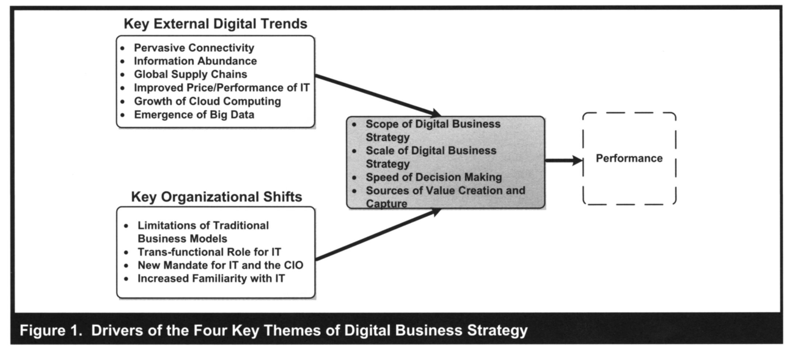
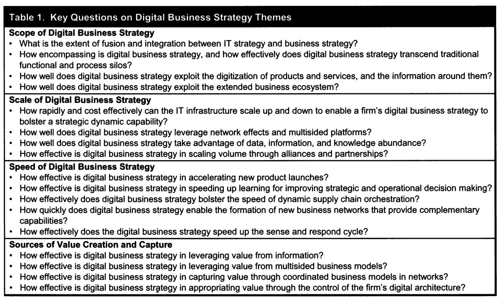

# Bharadwaj et al. (2013) – Digital Business Strategy

**Kilde:** Bharadwaj, A., El Sawy, O. A., Pavlou, P. A. & Venkatraman, N. (2013). *Digital Business Strategy: Toward a Next Generation of Insights*. MIS Quarterly, 37(2), 471–482.

**Sidetal:** Trykte sidetal. PDF-side = trykt side minus 469. Teksten er en konceptuel introduktion til et temanummer og en forskningsdagsorden, ikke ét selvstændigt empirisk casestudie. Eksempler fra artiklen beskriver forhold på dens tidspunkt.

## 1. Hovedpointen

Når digitale ressourcer indgår i produkter, processer, relationer og indtjening, bliver det utilstrækkeligt kun at lade en separat it-strategi understøtte en allerede besluttet forretningsstrategi. Forfatterne argumenterer for **fusion mellem IT strategy og business strategy**: digital business strategy. (s. 471–473)

Deres arbejdsdefinition kan gengives sådan på dansk:

> Digital forretningsstrategi er en organisatorisk strategi, som formuleres og gennemføres ved at anvende digitale ressourcer til at skabe differentierende værdi. (Parafrase af s. 472)

**Differential value** peger på værdi, der skaber en strategisk forskel. Fokus er bredere end billigere drift: digitale ressourcer kan ændre, hvad virksomheden tilbyder, hvem den samarbejder med, og hvordan den får del i værdien.

## 2. Hvad betyder “strategy” her?

Artiklen giver en arbejdsdefinition af **digital business strategy**, ikke en fuld gennemgang af generel strategiteori. Dens perspektiv er inspireret af **resource-based view** og **dynamic capabilities**: Hvilke ressourcer og evner har virksomheden, og hvordan kan de bruges og omformes under skiftende betingelser? (s. 472, 481)

**Digital resources** er bredere end hardware og software. Forfatterne fremhæver også data, information og de praksisser, protokoller og institutionelle forhold, som organiserer teknologianvendelsen. (s. 474)

### Fusion er mere end koordinering

En forenklet kontrast i artiklens argument:

- Ved en underordnet it-strategi spørger man: “Hvordan kan IT understøtte den valgte forretning?”
- Ved digital forretningsstrategi spørger man også: “Hvilken forretning bliver mulig gennem digitale ressourcer?”

Forfatterne ved godt, at tidligere alignment-forskning også har diskuteret påvirkning fra IT til forretning. Deres pointe er at gøre integrationen grundlæggende frem for at fastholde IT som en underordnet funktion. De dokumenterer ikke, at al tidligere alignment-tænkning var ensrettet. (s. 472–473)

**Eget eksempel:** At digitalisere en papirformular kan støtte en eksisterende proces. At bygge en service, hvor kunden løbende køber adgang til produktdata og optimering, kan ændre selve forretningsmodellen. Den første ændring er ikke automatisk strategisk fusion.

## 3. Figur 1: fire temaer i digital forretningsstrategi

*Figur 1, s. 473.*

Figuren forbinder eksterne digitale tendenser og organisatoriske ændringer med fire temaer og performance. Forfatterne angiver, at eksemplerne på drivere ikke er udtømmende. (s. 472–473)

| Tema | Dansk huskeregel | Kernespørgsmål |
| --- | --- | --- |
| **Scope** | Bredde og grænser | Hvilke aktiviteter, produkter og relationer omfatter strategien? |
| **Scale** | Omfang og skalering | Hvordan kan kapacitet, rækkevidde og aktivitet øges eller reduceres? |
| **Speed** | Tempo og reaktion | Hvor hurtigt kan organisationen beslutte, lancere og omstille? |
| **Sources of value creation and capture** | Værdiskabelse og indtjening | Hvad skaber værdi, og hvem får del i den? |

Figurens midterfelt siger “Speed of Decision Making”, mens brødteksten behandler speed bredere, også lanceringer, forsyningskæder og netværk. Den stiplede ramme om performance får ikke en særskilt forklaring som en måleskala eller en bestemt styrke af effekt. Figuren er et konceptuelt overblik, ikke en statistisk testet årsagsmodel.

## 4. Scope – hvad er virksomhedens strategiske grænser?

### A. På tværs af funktioner og processer

**Trans-functional** betyder her, at digitale ressourcer forbinder og gennemtrænger funktionerne. Strategien rækker over marketing, indkøb, produktion, service og IT; den tilhører ikke kun CIO'en. (s. 473)

### B. Produkter, services og information omkring dem

Digital strategi omfatter både selve produktet og den information, der ledsager det. Et fysisk produkt kan få digitale funktioner og serviceydelser, uden at virksomheden bliver en ren softwarevirksomhed. (s. 474)

Artiklen bruger blandt andet Amazon til at vise, at detailhandel, Kindle og AWS kan have fælles digitale ressourcer, selv om en traditionel brancheklassifikation får dem til at se fjernt beslægtede ud. Den nævner også forbundne produkter hos GE og Nike. Det er historiske eksempler fra teksten.

### C. Ud over virksomheden til økosystemet

Strategien skal tage højde for partnere, platforme, komplementære tjenester og konkurrenter. Virksomheden kan være afhængig af andre for at levere hele kundeoplevelsen. Derfor kan grænsen for den relevante strategi være bredere end ejerskab og en traditionel forsyningskæde. (s. 474–475)

**Eget eksempel:** En producent tilbyder dokumentation og sporbarhed gennem en kundeportal. Scope handler om, at tilbuddet nu omfatter et digitalt informationslag og relationer til kundernes systemer – ikke kun de fysiske varer.

## 5. Scale – mere end større fabrikker

Forfatterne beskriver fire dimensioner: (s. 475–476)

1. **Hurtig op- og nedskalering:** Cloud kan gøre det muligt at ændre kapacitet efter behov. Den organisatoriske evne til at bruge fleksibiliteten kan blive strategisk vigtig.
2. **Netværkseffekter og multisidede platforme:** Værdien kan stige, når flere relevante brugere eller partnere deltager.
3. **Information abundance:** Der er store mængder data, men organisationen skal kunne håndtere og anvende dem.
4. **Alliancer og partnerskaber:** Virksomheden kan opnå rækkevidde gennem andres ressourcer frem for at eje alt selv.

**Scope og scale er forskellige:** At tilføje en ny type service udvider scope. At betjene langt flere kunder med den service er skalering. De kan ændre sig samtidig, men er ikke synonymer.

**Netværkseffekt er ikke bare stordrift:** Lavere omkostning pr. enhed ved større volumen er en skalafordel. At flere sælgere gør en markedsplads mere interessant for købere, og omvendt, er en netværkseffekt. Dette er en forklarende sondring til artikelafsnittet.

## 6. Speed – tempoet skal passe til markedet

Artiklen udfolder fire former for hastighed: (s. 476–477)

| Form | Hvad skal gå hurtigere? | Hvad kan blive overset? |
| --- | --- | --- |
| **Product launches** | Udvikling og lancering af nye tilbud. | Komplementære produkter og partnere skal være klar samtidig. |
| **Decision making** | At omsætte information til beslutninger og handling. | Flere data hjælper ikke, hvis beslutningsprocessen stadig er langsom. |
| **Supply chain orchestration** | Koordination af leverancer og produktion på tværs af aktører. | At annoncere noget først er ikke nok, hvis det ikke kan leveres. |
| **Network formation and adaptation** | At etablere og omforme partnernetværk. | Evnen til at samarbejde og skifte relationer er også organisatorisk. |

**Sense and respond** betyder at opfange relevante ændringer og reagere på dem. **Clock speed** er den relevante rytme i markedet og konkurrencen. Forfatterne understreger, at speed skal vurderes **relativt til omgivelserne**, ikke som et ubetinget mål om størst mulig hastighed. (s. 480–481)

**Eget eksempel:** Et dashboard opdateres hvert minut, men produktionsplanen ændres kun på et ugentligt møde. Hurtige data er her ikke det samme som hurtig organisatorisk respons.

## 7. Value creation og value capture

**Value creation** er at skabe værdi for aktører, fx bedre service, information eller matchning. **Value capture/appropriation** er at få del i den skabte værdi, fx gennem betaling, margin eller kontrol over væsentlige forbindelser. Stor anvendelse er derfor ikke i sig selv det samme som indtjening. (s. 477–478)

Forfatterne peger på fire kilder:

| Kilde | Forklaring | Egen illustration |
| --- | --- | --- |
| **Værdi fra information** | Information kan forbedre tilbud og beslutninger eller være en del af produktet. | En tjeneste giver brugeren bedre overblik og anbefalinger. |
| **Multisidede forretningsmodeller** | Flere grupper indgår; én kan betale for adgang til en anden. | Brugere får en gratis tjeneste, mens annoncører betaler. |
| **Koordinerede forretningsmodeller i netværk** | Flere virksomheder skaber og fordeler værdi sammen. | Spiludviklere, udgivere og en platform koordinerer tilbud og betaling. |
| **Kontrol over digital branchearkitektur** | En strategisk position kan give indflydelse på adgang og værdifordeling. | Den, der kontrollerer en vigtig distributionskanal, kan tage betaling for adgang. |

**Multisided** og **multilayered** hænger sammen, men er ikke helt det samme. Multisided handler om flere deltagergrupper. Multilayered fremhæver, at en virksomhed kan tilbyde noget gratis i ét lag og tjene penge i et andet. Android og reklameindtjening bruges som eksempel i teksten. (s. 478)

**Control points** er vigtige positioner, hvor aktører kan påvirke adgang eller værdistrømme. At skabe en værdifuld tjeneste betyder ikke nødvendigvis, at producenten selv får størstedelen af værdien; andre aktører kan kontrollere kundeadgang eller distribution. (s. 478–480)

## 8. Svar på læsevejledningen: hvilke markeder kan profitere?

Nedenstående er **egne markedseksempler til diskussion**, ikke dokumentation for bestemte virksomheders aktuelle overskud.

| Marked | Digital værdiskabelse | Mulig value capture | Relevant tema |
| --- | --- | --- | --- |
| **Musik- og videostreaming** | Distribution, adgang, søgning og personalisering. | Abonnementer eller annoncer; indtægter fordeles med rettighedshavere. | Scale, information, netværk af komplementære aktører. |
| **Digitale markedspladser** | Matchning mellem købere og sælgere, søgning og tillidssignaler. | Transaktionsgebyrer eller betaling for synlighed. | Netværkseffekter, multisided models, control points. |
| **Spil og appdistribution** | Digitale produkter, opdateringer og adgang til mange brugere. | Salg, abonnementer eller køb i produktet samt betaling til distributionsled. | Scope, speed, koordinerede forretningsmodeller. |
| **Betalingstjenester** | Hurtigere betaling og forbindelse mellem kunder og forretninger. | Gebyrer eller tilknyttede serviceydelser. | Scale og samspil mellem flere deltagergrupper. |
| **Industrielle serviceydelser** | Data om brug, kvalitet eller vedligeholdelse omkring et fysisk produkt. | Serviceaftaler eller betaling for digitale tillægsydelser. | Udvidet scope og værdi fra information. |

**Et svar, du kan sige i timen:** “Digitale markedspladser er et eksempel. Teknologien skaber værdi ved at gøre matchning og handel lettere, og flere relevante deltagere kan øge værdien. Platformen kan indfange noget af værdien gennem gebyrer. Men vi må skelne mellem, at markedet bliver mere effektivt, og hvem der faktisk tjener pengene.”

Det er også relevant at spørge, **hvem der taber**: Et digitalt marked kan omfordele værdien fra tidligere mellemled til nye platforme. Teksten diskuterer netop ændret magt og disintermediation. (s. 477–478)

## 9. Tabel 1 som analyseværktøj

*Tabel 1, s. 479. Brug den til spørgsmål, ikke som et valideret pointsystem.*

Fire spørgsmål til jeres egen case, afledt af tabellen:

- **Scope:** Ændrer digitale løsninger tilbuddet og samarbejdsrelationerne eller hovedsagelig intern administration?
- **Scale:** Hvilke flaskehalse gør det svært at håndtere flere ordrer eller kunder?
- **Speed:** Hvor lang tid går der fra information er tilgængelig, til nogen kan handle på den?
- **Value:** Hvem oplever forbedringen, og hvordan får virksomheden del i gevinsten?

For TRECO kan I undersøge samspillet mellem ordredata, planlægning, produktion og kundernes informationsbehov. Det er undersøgelsesmuligheder, ikke en konklusion om, at virksomheden allerede har digital business strategy.

## 10. Metode, bidrag og begrænsninger

Forfatterne udvikler temaerne gennem egne drøftelser, bidrag til temanummeret og samtaler med forskere og praktikere. Artiklen sammenfatter og positionerer et forskningsfelt; den afprøver ikke de fire temaer som en samlet kausal model. (s. 472–473)

Afsnittet s. 478–480 præsenterer andre studier i temanummeret. Resultaterne derfra skal ikke omtales, som om denne artikel selv har indsamlet alle disse data.

**Styrke:** Rammen gør digitale strategiers bredde og indtjeningslogik synlig og forbinder IT med centrale strategispørgsmål.

**Begrænsning:** Den er bred og giver ikke et færdigt måleredskab eller en universel implementeringsopskrift. Forfatterne siger selv, at generiske performancemål endnu ikke er på plads. Hurtigere, større og mere digitalt er derfor ikke i sig selv et dokumenteret bedre resultat. (s. 480–481)

## 11. Lingo

| Begreb | Dansk forklaring |
| --- | --- |
| **Fusion** | Sammensmeltning af IT- og forretningsstrategi. |
| **Trans-functional** | Gennemtrænger funktionerne frem for kun at ligge mellem separate afdelinger. |
| **Scope / scale** | Hvad strategien omfatter / størrelsen og muligheden for at skalere aktiviteter. |
| **Dynamic capabilities** | Evner til at tilpasse og omforme ressourcer under forandring. |
| **Resource-based view (RBV)** | Perspektiv, der forklarer strategiske muligheder ud fra ressourcer og kapabiliteter. |
| **Information abundance** | Stor tilgængelighed af data og information; ikke garanti for viden eller god anvendelse. |
| **Orchestration** | Koordination af ressourcer og aktører, som ikke nødvendigvis er under samme ejerskab. |
| **Complementarity** | At produkter, tjenester eller ressourcer øger hinandens nytte. |
| **Multisided platform** | Platform, der forbinder flere gensidigt relevante deltagergrupper. |
| **Appropriation / capture** | At få del i den skabte værdi. |
| **Disintermediation** | At tidligere mellemled omgås eller mister deres rolle. |
| **Pure-play digital** | Virksomhed med et primært digitalt tilbud, i kontrast til blandinger af fysisk og digitalt. |
| **Prosumer** | Deltager, der både forbruger og bidrager til indhold/værdi. |
| **Contemporary** | Nutidig i tekstens sammenhæng, ikke nødvendigvis nutidig i dag. |

## 12. Tjek dig selv

1. Hvordan går digital business strategy videre end at understøtte en eksisterende forretningsstrategi?
2. Hvad er forskellen på scope og scale?
3. Hvorfor kræver hurtigere beslutninger mere end nye dataværktøjer?
4. Giv et eksempel, hvor én aktør skaber værdi, mens en anden får en stor del af indtægten.
5. Hvorfor er figur 1 ikke et bevis på, at de fire temaer altid forbedrer performance?

## Noter fra timen

- Underviserens pointer:
- Markedseksempler:
- Kobling til case:
- Spørgsmål:

Relateret: [[Chen-2010-Information-Systems-Strategy]] · [[Strategilektion-Laesevejledning-og-case]]
