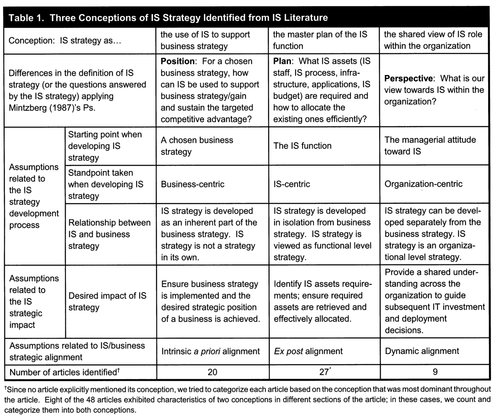
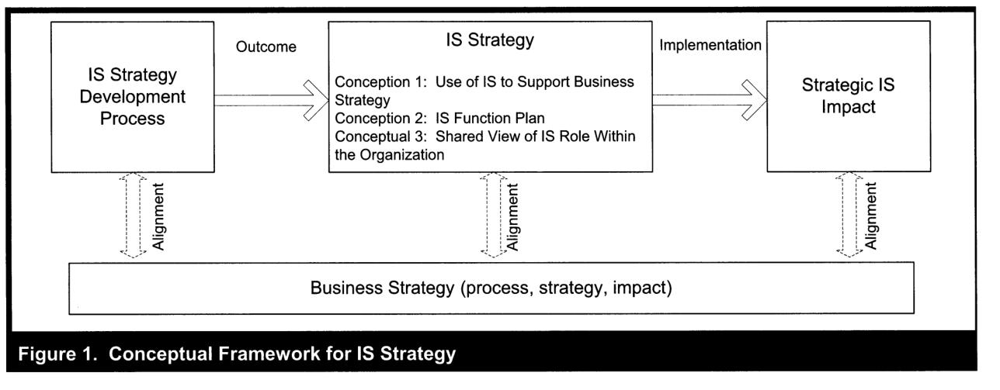
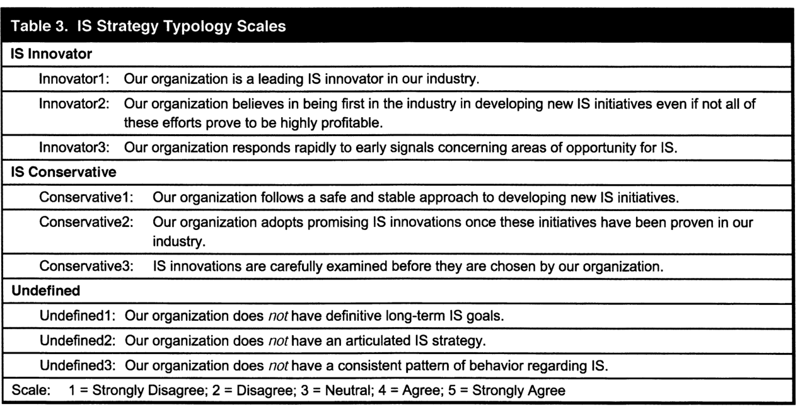
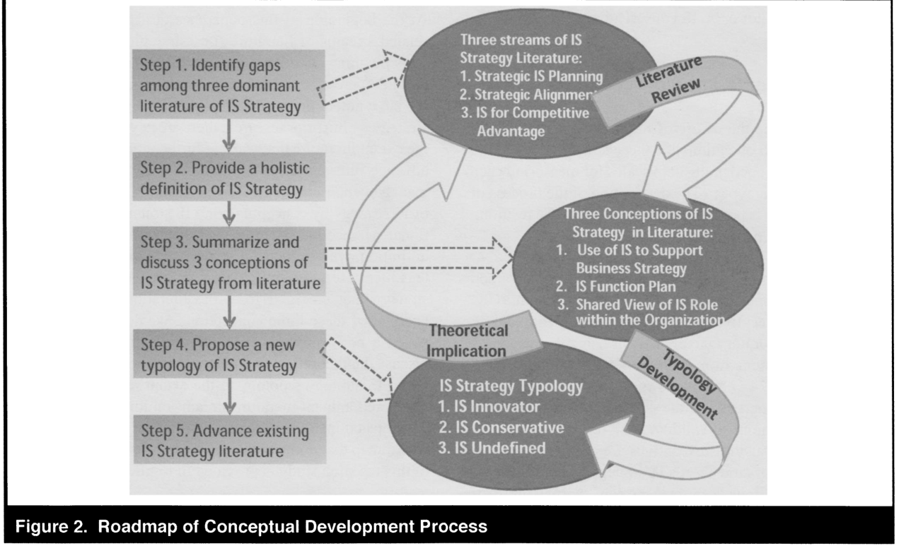

# Chen et al. (2010) – Information Systems Strategy

**Kilde:** Chen, D. Q., Mocker, M., Preston, D. S. & Teubner, A. (2010). *Information Systems Strategy: Reconceptualization, Measurement, and Implications*. MIS Quarterly, 34(2), 233–259.

**Sidetal:** Trykte sidetal. PDF-side = trykt side minus 231. Pensumlisten angiver 233–254; den uploadede artikel løber til 259. Hovedteksten slutter på s. 252, derefter følger referencer og forfatteroplysninger. De særskilte onlineappendikser er ikke med i filen.

## 1. Hovedpointen

IS-strategi er ikke nødvendigvis et dokument med en liste over systemer, og den er heller ikke bare en teknisk oversættelse af forretningsstrategien. Chen et al. definerer den som **organisationens perspektiv på investering i, implementering, anvendelse og ledelse af informationssystemer**. Perspektivet skal være fælles på tværs af forretnings- og IS-ledelsen. (s. 236–237)

Artiklen foreslår tre typer: **IS innovator**, **IS conservative** og **undefined**. De handler om organisationens grundlæggende tilgang til innovation med IS, ikke om hvilken konkret teknologi den har købt. (s. 243–246)

> [!important] Til læsevejledningen
> Spørgsmålet om “tre billeder” af innovation og IS peger på disse tre strategityper. Artiklen har også en anden tredeling: tre forståelser af, hvad IS-strategi er. Hold de to tredelinger adskilt.

## 2. Hvad betyder “strategy”?

### Strategi som plan er kun én mulighed

Forfatterne gennemgår Mintzbergs fem P'er. De er forskellige, supplerende måder at forstå strategi på: (s. 236–237)

| P | Dansk forklaring | Eget eksempel |
| --- | --- | --- |
| **Plan** | En tilsigtet fremgangsmåde. | En plan for fælles ERP over tre år. |
| **Ploy** | En manøvre rettet mod konkurrenter. | Et strategisk udspil, der skal afholde en rival fra at gå ind på et marked. |
| **Pattern** | Et mønster i de handlinger, organisationen faktisk udfører. | Virksomheden vælger konsekvent modne standardløsninger. |
| **Position** | Organisationens placering i forhold til omgivelser og konkurrence. | At konkurrere på lave omkostninger eller særlig service. |
| **Perspective** | En fælles måde at forstå organisationen og dens retning på. | Ledelsen ser IS som en kilde til nye forretningsmuligheder. |

**Chens valg er perspective.** Strategien kan vise sig i intentioner og i handlinger og behøver ikke kun at være en formel plan. Det gør det muligt at rumme både **deliberate strategy** – tilsigtet strategi – og **emergent strategy** – strategi, der udvikler sig gennem praksis. (s. 236–237)

Det betyder dog ikke, at ethvert tilfældigt it-køb i sig selv beviser, at organisationen har en sammenhængende strategi.

### IS er bredere end IT

Artiklens IS-begreb omfatter både teknologi og menneskelige aktiviteter omkring anvendelse og ledelse. Derfor er “IS strategy” bredere end en beslutning om servere, programmer eller tekniske standarder alene. (s. 237)

Forfatterne placerer IS-strategi på **organisationsniveau**, ikke alene som it-afdelingens funktionelle strategi. IS-strategien skal kunne understøtte **og udfordre** forretningsstrategien. (s. 237)

## 3. Tre forståelser af IS-strategi i forskningen

Litteraturgennemgangen identificerer tre **conceptions**: grundlæggende antagelser om, hvad IS-strategi er. (s. 238–243)

*Tabel 1, s. 239. Tabellen sammenligner definition, udvikling, forventet betydning og alignment.*

| Forståelse | Kernespørgsmål | Styrke | Udfordring |
| --- | --- | --- | --- |
| **I: IS som støtte til forretningsstrategien** | Hvordan hjælper IS med at realisere en valgt forretningsstrategi? | Tydelig kobling til forretningsmål. | Gør IS afhængig af en allerede fastlagt retning og kan overse nye muligheder. |
| **II: IS som it-funktionens masterplan** | Hvilke mennesker, systemer, processer og budgetter behøver it-funktionen? | Konkret grundlag for ressourceprioritering og drift. | Kan blive isoleret fra organisationens øvrige mål. |
| **III: IS som fælles syn på IS' rolle** | Hvilken rolle skal IS spille i organisationen? | Forbinder forretning og IS gennem en fælles forståelse. | Kan blive for ledelsescentreret og overse initiativer længere nede i organisationen. |

Forståelse I er **business-centric**, II **IS-centric** og III **organization-centric**. Forfatterne foretrækker III som grundlag for videre teoriudvikling. De afviser ikke, at de andre perspektiver kan være nyttige. (s. 240–243)

### Alignment betyder noget forskelligt i de tre forståelser

- **I – a priori alignment:** IS-strategien afledes af forretningens strategi og forventes derfor at passe fra starten.
- **II – ex post alignment:** Strategierne udformes med hvert sit fokus og skal bringes i sammenhæng.
- **III – dynamic alignment:** Retningerne tilpasses løbende gennem et fælles perspektiv og gensidig påvirkning. (s. 239–242)

**Eget eksempel:** “Vi skal have et billigere ERP-system” siger ikke alene, hvilken forståelse der bruges. Begrundelsen kan være et bestemt forretningsmål, it-afdelingens omkostninger eller en fælles opfattelse af, hvilken rolle IS skal spille.

## 4. Figur 1: strategi er ikke det samme som processen eller resultatet

*Figur 1, s. 239; forklaring s. 238.*

Læs fra venstre mod højre:

1. **IS strategy development process:** Hvordan strategien udvikles.
2. **IS strategy:** Selve strategiens indhold eller perspektiv.
3. **Strategic IS impact:** De virkninger, implementering kan føre til.

Forretningsstrategien nedenunder forbindes med alle tre gennem alignment. Modellen hjælper med at holde analytiske spørgsmål adskilt: Et velbeskrevet planlægningsforløb er ikke det samme som en klar strategi, og en strategi er ikke det samme som dokumenteret konkurrencefordel.

Pilene er begrebslige relationer. Figuren dokumenterer ikke, at strategier automatisk giver positive resultater, og artiklen angiver ikke en generel fortolkningsnøgle om stærkt/svagt samarbejde ud fra linjetyperne.

## 5. De tre strategityper – svar på læsevejledningen

Typologien bygger på **exploration** og **exploitation** fra organisatorisk læring. (s. 243–245)

- **Exploration:** At undersøge nye muligheder, eksperimentere og acceptere usikre resultater.
- **Exploitation:** At udnytte, forbedre og videreudvikle eksisterende viden og løsninger. Her betyder ordet ikke udnyttelse af mennesker.

| Strategitype | Grundlæggende perspektiv | Typisk adfærd | Risiko/nuance |
| --- | --- | --- | --- |
| **IS innovator** | Vi søger nye muligheder med IS og ønsker at være førende. | Eksperimenterer og reagerer tidligt på muligheder. | Højere usikkerhed; er ikke nødvendigvis først med enhver teknologi. |
| **IS conservative** | Vi skaber værdi med gennemprøvede løsninger og forbedringer. | Vurderer omhyggeligt og lærer af andres erfaringer. | Kan gå glip af muligheder, men kan opnå gode resultater med mindre risiko. |
| **Undefined** | Vi har ikke en klar, konsistent retning for IS. | Manglende langsigtede mål og usammenhængende valg. | Er ikke det samme som bevidst forsigtighed. |

### Innovation er ikke lig med den nyeste teknologi

En innovator kan anvende moden teknologi på en ny måde. Det afgørende er en vedvarende orientering mod nye muligheder med IS. En konservativ organisation kan omvendt enkelte gange være tidligt ude uden at ændre sit grundlæggende perspektiv. Klassificér derfor ikke ud fra ét køb eller ét projekt. (s. 243–244)

### Conservative er en strategi; undefined er mangel på sammenhæng

Den konservative organisation har en bevidst prioritering: afprøvede muligheder, stabilitet og forbedring. Den udefinerede har ikke samme klare retning. Manglende skriftligt strategidokument er dog **ikke i sig selv** tilstrækkeligt til at kalde strategien undefined: perspektivet kan være implicit, men konsistent. (s. 237, 244–246)

### Ambidexterity – hvorfor ikke være begge dele?

**Organizational ambidexterity** betyder evnen til at arbejde med både exploration og exploitation. Chen et al. anerkender, at organisationer kan udvise begge adfærdstyper, men argumenterer for typologier med én dominerende orientering. De fremhæver vanskelighederne ved samtidig at maksimere innovation og effektivitet. (s. 244–245)

Det er en teoretisk afgrænsning, ikke et bevis for, at blandinger er umulige. Forfatterne peger selv på behov for yderligere undersøgelse af typernes gensidige udelukkelse. (s. 252)

## 6. Hvordan måler de strategityperne?

*Tabel 3, s. 246. Ni udsagn: tre pr. type, besvaret på en fempunktsskala fra stærkt uenig til stærkt enig.*

Udsagnene undersøger blandt andet tidlig reaktion på muligheder, en sikker og afprøvet tilgang samt mangel på mål og konsistens. De måler ikke blot antal systemer, it-budget eller teknologiernes alder.

Forfatterne rapporterer en eksplorativ faktoranalyse baseret på besvarelser fra CIO'er og ledende forretningsrepræsentanter i **174 amerikanske organisationer**. De finder støtte til målenes struktur og sammenlignelighed mellem respondentgrupperne. Detaljerne henvises til onlineappendiks D, som ikke er med i uploaden. (s. 245–246)

**Vigtig skelnen:** Afprøvningen af måleinstrumentet er ikke en empirisk test af alle artiklens senere påstande om resultater, planlægning og konkurrencefordele.

**Til et interviewprojekt:** Brug temaerne som inspiration og spørg efter konkrete eksempler. Spørg fx “Fortæl om sidste gang I valgte en ny løsning, og hvad der talte for og imod.” En samtale baseret på spørgsmålene er ikke automatisk samme måling som artiklens validerede skala.

## 7. Propositioner: hvad forventer forfatterne?

En **proposition** er et teoretisk udsagn, der kan undersøges. Artiklen opstiller følgende forventninger, men tester dem ikke empirisk her. (s. 247–252)

| Område | IS innovator | IS conservative |
| --- | --- | --- |
| **Planlægning** | Mindre formalisering og bottom-up-input forventes at understøtte kreativitet. | Mere formalisering og top-down-styring forventes at understøtte kontrol. |
| **Relation til forretningsstrategi** | IS-strategien er godt positioneret til at drive forretningens retning. | Forretningsstrategien er godt positioneret til at drive IS-strategien. |
| **Konkurrence og resultater** | Større potentiale for konkurrencefordel, men også større variation i resultater. | Mere forsigtig forbedring med mindre risikofyldt eksponering. |

Propositionerne om planlægning står s. 248–249; om strategiernes retning s. 250; om konkurrencefordel og resultatvariation s. 251. Forfatterne forventer også, at innovatorer klarer sig bedre i turbulente omgivelser. (s. 252)

**Competitive advantage ≠ firm performance.** En strategi kan give mulighed for at skille sig ud, men stadig blive dyr eller mislykkes. Derfor siger artiklen ikke “innovator er altid bedst”. (s. 250–251)

**Mindful organization** betegner en organisation, der træffer IS-valg ud fra en forståelse af sin egen situation. Både innovator og conservative kan være mindful. Det handler om bevidsthed og sammenhæng, ikke om altid at vælge den mest avancerede teknologi. (s. 247)

## 8. Figur 2: artikelargumentets opbygning

*Figur 2, s. 246.*

Figuren viser forfatternes vej fra mangler i forskningen over definition og litteraturgennemgang til typologi og teoretiske implikationer. Den viser **ikke** en organisations udvikling fra undefined til conservative til innovator. Strategityperne er ikke obligatoriske modenhedstrin.

De stiplede pile forbinder udvalgte trin i venstre side med begrebsgrupper i højre side; de brede pile viser artikelarbejdets forbindelser mellem review, typologi og implikationer. Der angives ikke en generel betydning som “mindre samarbejde”.

## 9. Metode og kritisk vurdering

Artiklen kombinerer begrebsudvikling, litteraturgennemgang, udvikling/afprøvning af mål og teoretiske propositioner. Af mere end 1.600 søgefund udvælges 401 relevante artikler; 48 undersøger selve IS-strategibegrebet. Nogle indgår i mere end én conception, så kategorital kan ikke blot lægges sammen til 48. (s. 238–239)

**Styrke:** Den gør det tydeligt, hvad forskere og ledere mener, når de siger “IS-strategi”, og tilbyder et måleredskab.

**Forbehold:** Perspektivet fokuserer stærkt på ledelsen. Et fælles syn blandt ledere er ikke bevis for, at medarbejdere oplever samme retning. Typologien forenkler en kompleks virkelighed, og propositionerne kræver efterfølgende empirisk undersøgelse. (s. 241–245, 252)

## 10. Anvendelse på TRECO – undersøgelsesspørgsmål

Dette er **egen anvendelse**, ikke resultater om TRECO:

- Ser ledelse og medarbejdere ERP som et kontrolsystem, et effektiviseringsværktøj eller grundlag for nye muligheder?
- Hvem foreslår ændringer, og hvem prioriterer dem?
- Vælges nye løsninger typisk efter afprøvning i branchen, eller eksperimenterer man selv?
- Kan ledere på tværs af funktioner forklare samme langsigtede retning?
- Hvordan hænger den formulerede retning sammen med konkrete prioriteringer og daglige arbejdsgange?

At et ERP-system anvendes uensartet er **ikke nok** til at konkludere “undefined”. Det kan også skyldes uddannelse, lokale behov, data eller implementeringsforhold. Undersøg både perspektiver og praksis, før I klassificerer.

## 11. Lingo

| Begreb | Kort forklaring |
| --- | --- |
| **Conception** | Grundlæggende forståelse og antagelser om et begreb. |
| **Construct** | Et teoretisk begreb, som må afgrænses og eventuelt måles. |
| **Operationalization** | At omsætte et begreb til noget, der kan undersøges empirisk. |
| **Typology** | Inddeling i analytiske typer. |
| **SISP** | Strategic Information Systems Planning: strategisk planlægning af IS. |
| **TMT / CIO** | Top Management Team / Chief Information Officer. |
| **Social alignment** | Fælles forståelse mellem forretnings- og IS-aktører. |
| **Intellectual alignment** | Sammenhæng mellem strategiernes og planernes indhold. |
| **Coevolution** | Gensidig udvikling over tid. |
| **Rigidity trap** | Risiko for, at meget tæt sammenkoblede planer bliver vanskelige at ændre. |
| **Bricolage** | At udvikle løsninger med de ressourcer og erfaringer, der er til rådighed; omtalt i diskussionen af bottom-up. |
| **Contingency** | At noget afhænger af konteksten frem for altid at virke ens. |
| **Extant / contemporary** | Eksisterende / nutidig i tekstens tidskontekst. |

*Læsehjælp baseret på s. 236–252; formuleringerne er danske forklaringer, ikke direkte citater.*

## 12. Tjek dig selv

1. Hvordan kan en organisation have en IS-strategi uden et strategidokument?
2. Forklar forskellen på tre conceptions og tre strategityper.
3. Hvorfor er conservative ikke det samme som undefined?
4. Hvorfor beviser et enkelt AI- eller ERP-projekt ikke, at organisationen er innovator?
5. Hvad er empirisk afprøvet, og hvad er foreslået som propositioner?

## Noter fra timen

- Underviserens forklaring:
- Eksempler:
- Spørgsmål:

Relateret: [[Bharadwaj-2013-Digital-Business-Strategy]] · [[Strategilektion-Laesevejledning-og-case]]
