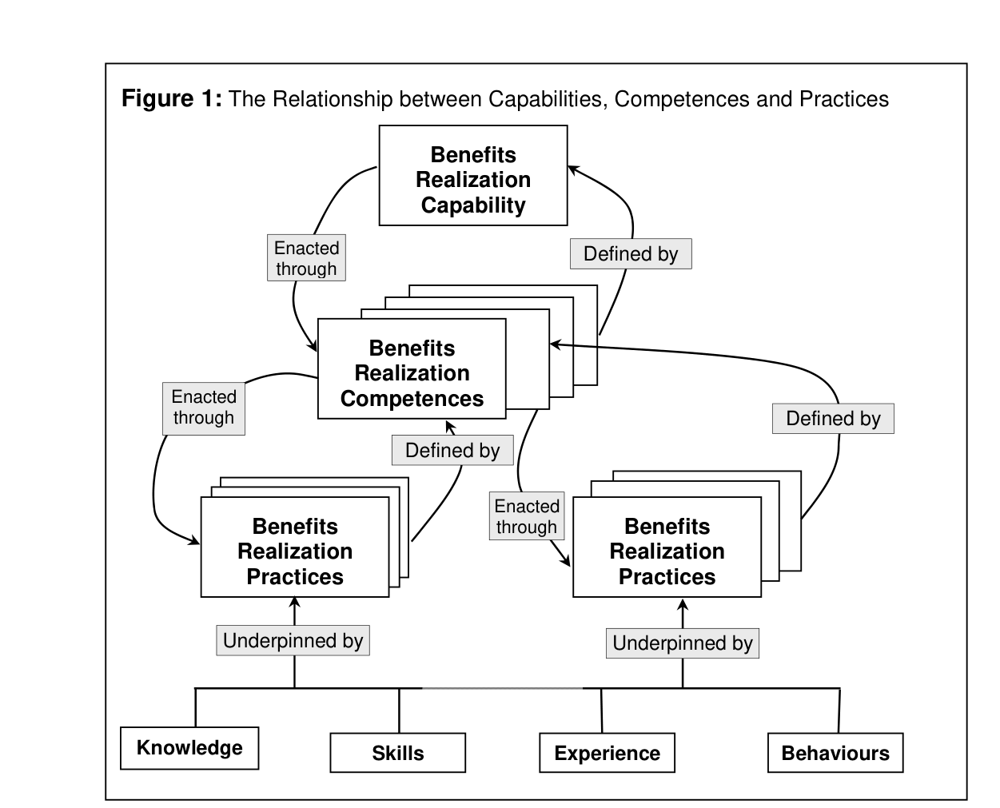
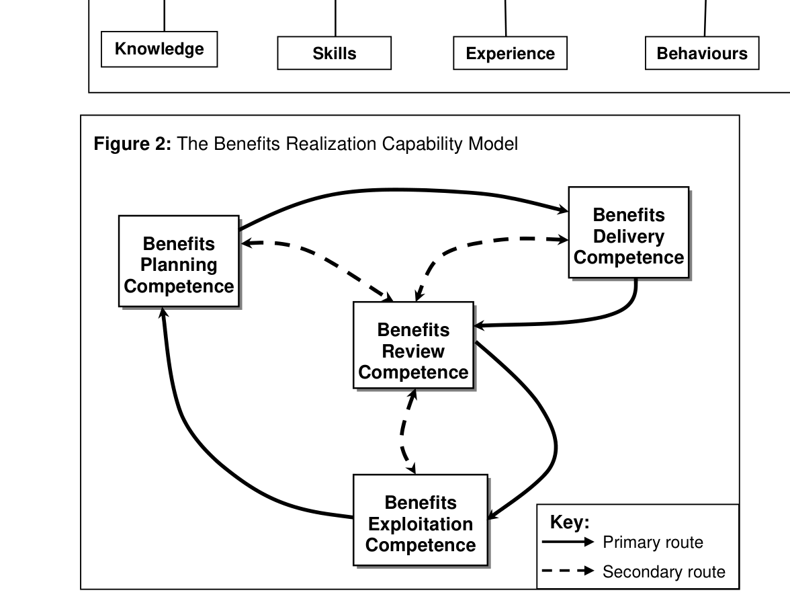

# Ashurst, Doherty & Peppard – Benefits Realization Capability Model

**Kilde:** Ashurst, C., Doherty, N. F. & Peppard, J. (2008). *Improving the Impact of IT Development Projects: The Benefits Realization Capability Model*. *European Journal of Information Systems*, 17(4), 352–370. DOI: 10.1057/ejis.2008.33. Den vedlagte PDF er en repository-/manuskriptversion. **Sidetal nedenfor følger manuskriptets trykte sidetal**; fx manuskript s. 31 er PDF-side 32.

## Hovedidé

En IT-løsning skaber ikke automatisk de forventede gevinster. Værdien kræver planlagte og gennemførte ændringer i arbejde, processer og ansvar, efterfulgt af evaluering og videreudvikling. Forfatterne kalder organisationens samlede evne til dette en **benefits realization capability** (evne til at realisere gevinster). I undersøgelsen af **25 IT-projekter** fandt de ikke nogen sammenhængende og konsekvent anvendelse af de nødvendige praksisser (abstract; s. 20–21).

> [!important] Skel til eksamen
> **Teknisk projektsucces** = løsningen leveres efter plan, budget og specifikation. **Forretningsmæssig gevinst** = konkrete forbedringer opstår i organisationens arbejde. En webshop i undersøgelsen blev leveret teknisk korrekt, men blev senere lukket, fordi den ikke tiltrak kunder (s. 19).

## Fra ressourcer til handling

Artiklen trækker på *resource-based view* (RBV): ressourcer giver først værdi, når organisationen kan kombinere og anvende dem. **Capability** er den overordnede organisatoriske evne; **competence** er en af de særskilte evner, som indgår i den; **practice** er en konkret, socialt etableret måde, medarbejdere faktisk handler på. Praksisser bygger på viden, færdigheder, erfaring og adfærd. En praksis er dermed mere konkret og observerbar end en kompetence, men ikke en mekanisk opskrift (s. 5–8).

*Figur 1, manuskript s. 31 (PDF-side 32).* Læs figuren nedefra: medarbejderes viden og handlinger understøtter praksisser → praksisser udgør kompetencer → kompetencer realiserer den samlede organisatoriske evne. Figuren skelner også mellem, hvad der **definerer** en evne, og hvad den **udøves gennem**.

## De fire kompetencer

| Kompetence | Betydning | Spørgsmål i et projekt |
| --- | --- | --- |
| **Benefits planning** | Beskrive ønskede gevinster og hvordan de kan opstå. | Hvilken forbedring, for hvem, målt hvordan, og via hvilke ændringer? |
| **Benefits delivery** | Designe og gennemføre de organisatoriske ændringer, som gør gevinster mulige. | Ændres rutiner, roller, oplæring og beslutninger samtidig med teknologien? |
| **Benefits review** | Sammenholde mulige, forventede og realiserede gevinster og lære af forskellene. | Kom gevinsterne, og hvad skal justeres? |
| **Benefits exploitation** | Fortsat udnytte løsningen og informationen efter idriftsættelse. | Hvem ejer forbedringsarbejdet, og hvilke nye muligheder er opstået? |

Definitionerne udfoldes på s. 8–9. **Review er også løbende**, ikke kun et enkelt kontrolpunkt efter implementering; den stiplede rute i modellen viser feedback og justering undervejs (s. 10).

*Figur 2, manuskript s. 31 (PDF-side 32).* Hele pile viser en primær vej gennem planlægning, levering, review og fortsat udnyttelse. Stiplede pile viser, at review kan gribe ind i de andre kompetencer. Modellen er derfor ikke blot fire faser, der afsluttes én gang.

## Praksisserne bag modellen

**Tabel 1, manuskript s. 32–37 (PDF-side 33–38),** oplister praksisser og hvor ofte forfatterne fandt spor af dem i de 25 projekter. Koderne er **BP** (planning), **BD** (delivery), **BR** (review) og **BE** (exploitation). Udvalgte eksempler:

| Praksis | Hvorfor den betyder noget | Fund i materialet |
| --- | --- | --- |
| BP3: identificér og definér gevinster | Sæt mål, målestok og navngiven gevinstansvarlig. | Ofte vage eller tekniske formuleringer; ingen projekter etablerede benefit owners i dette punkt. |
| BP8: planlæg gevinstrealisering | Kobl business case til de ændringer, der faktisk skal levere gevinsten. | Meget lav forekomst. |
| BD4/BD7: ændr arbejds- og organisationsdesign | Gevinster kræver nye rutiner, roller og processer. | Ingen henholdsvis meget lav forekomst. |
| BR2/BR3: vurder gevinst og planlæg yderligere handling | Sammenlign faktisk og ønsket effekt; ret kursen. | Lav henholdsvis ingen forekomst. |
| BE1/BE3: fortsat ejerskab og videreudvikling | Gevinster kan opstå og ændre sig længe efter go-live. | Meget lav forekomst. |

*Præcision:* Tabel 1 koder **BP1** som *identify strategic drivers*. Et sted i løbeteksten kaldes den **BP2**; brug tabelkoden, hvis du henviser til praksissen (s. 14 og 32).

## Undersøgelse, fund og begrænsning

Forfatterne analyserede dokumentation fra 25 projekter hos én konsulentvirksomhed og fulgte op hos projektlederne; 18 svarede, hvoraf 15 svar var tilstrækkeligt detaljerede til analysen (s. 11–13). Mange projekter nævnte strategiske drivere og gevinster i starten for at få projektet godkendt, men tabte gevinstfokus under udvikling og drift. Projektteams blev typisk opløst omkring go-live, og efterfølgende gevinster blev sjældent målt systematisk (s. 19–21).

**Fortolkning:** Et dokumenteret fravær af en praksis er ikke nødvendigvis bevis for, at ingen udførte den; forfatterne erkender, at dokumentstudiet kunne overse uformelle handlinger. Én konsulentvirksomhed begrænser også, hvor bredt resultatet kan generaliseres (s. 12, 22). Tabel 1 er en **reference til tilpasning**, ikke en universel tjekliste (s. 22–23).

## Brug i en case, fx ERP-adoption

Hvis nogle medarbejdere ikke udnytter ERP-systemets muligheder, så spørg ikke kun, om funktionerne findes. Undersøg: **(1)** hvilken konkret gevinst der ønskes, **(2)** hvem der ejer den, **(3)** hvilke rutiner og roller der skal ændres, **(4)** hvilke indikatorer der kan måles før/efter, og **(5)** hvem der følger op efter idriftsættelse. Det er en anvendelse af modellen på casen, ikke et fund fra artiklen.

## Begreber at kunne sige højt

- **Benefits realization:** at omsætte potentiale fra IT-investeringen til faktiske, observerbare gevinster.
- **Capability / competence / practice:** samlet organisatorisk evne / delkompetence / konkret social arbejdspraksis.
- **Benefit owner:** navngiven person med ansvar for at arbejde mod og følge en bestemt gevinst.
- **Go-live:** tidspunktet hvor systemet sættes i drift; ikke nødvendigvis tidspunktet hvor værdien er skabt.
- **Post-implementation review:** gennemgang efter implementering af resultater og læring.

**Relateret:** [[Nielsen-og-Persson-2017-Useful-Business-Cases]] konkretiserer business case og ejerskab; [[Mitra-et-al-2011-Measuring-IT-Performance]] giver en ramme for at måle og kommunikere værdien.
