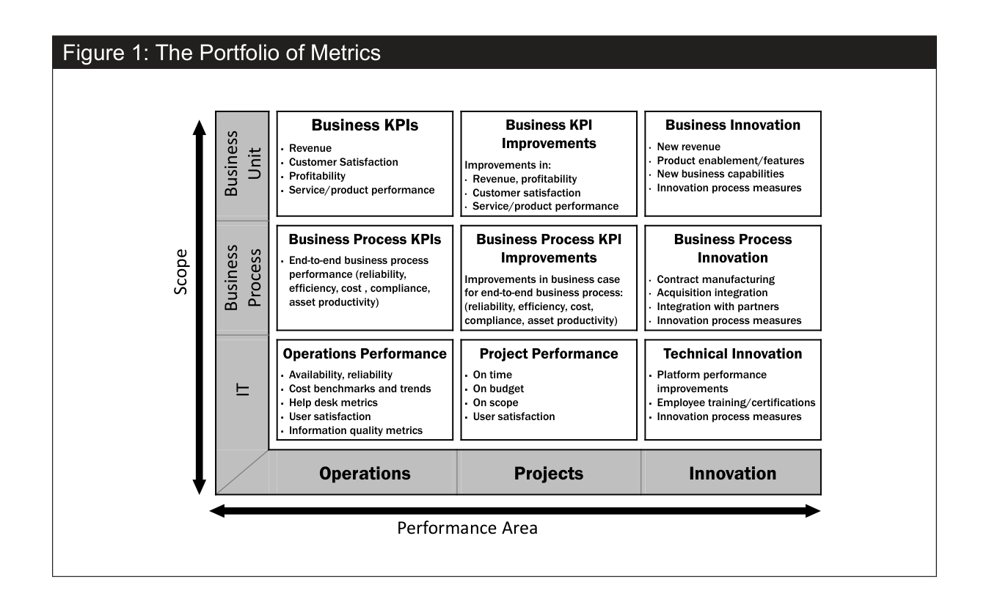
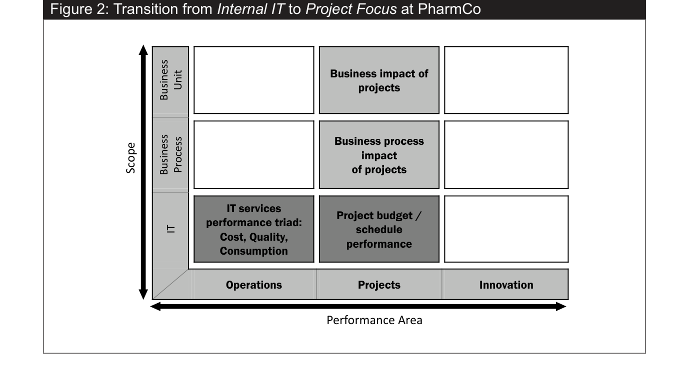
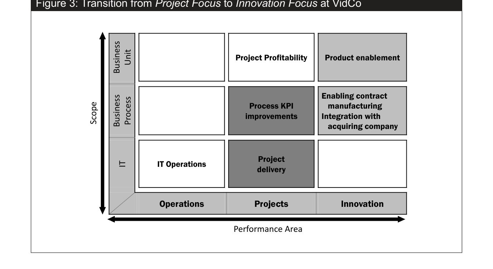
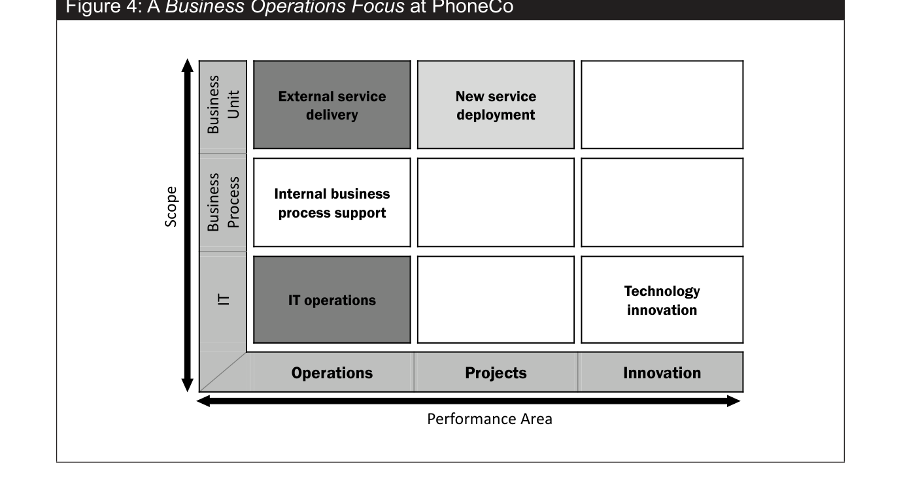
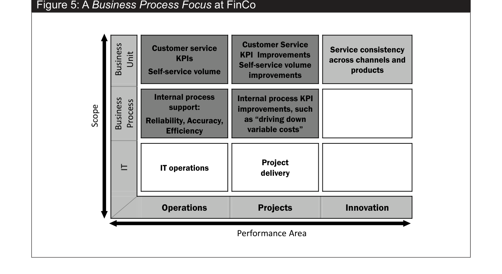
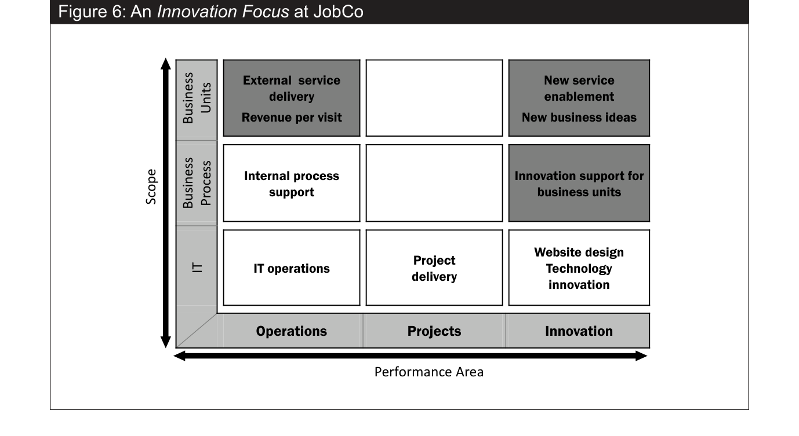

# Mitra, Sambamurthy & Westerman (2011) – Measuring IT Performance and Communicating Value

**Kilde:** *MIS Quarterly Executive*, 10(1). Den vedlagte PDF har en forside før artiklen. Henvisninger nedenfor er **artiklens trykte sidetal**, fx trykt s. 49 = PDF-side 4.

## Hovedidé

En CIO kan ikke forklare IT's værdi til ledelsen alene med IT-budgetter, oppetid eller om projekter blev leveret til tiden. Relevante målinger afhænger af **hvad interessenterne betragter som vigtigt**. Derfor foreslår forfatterne en **portfolio of metrics**, som forbinder IT-drift, projekter og innovation med proces- og forretningsresultater. Rammen bygger primært på interview med ledere fra **23 organisationer** (executive summary; metode s. 58).

Artiklens definition er, at IT-værdi måles gennem præstationsmål på dimensioner, som interessenter finder betydningsfulde (s. 49). Det har tre vigtige konsekvenser: målingen skal give mening for modtageren; dens betydning kan ændre sig over tid; og forbedring ud over et acceptabelt niveau giver ikke nødvendigvis tilsvarende ekstra værdi (s. 49).

## Figur 1: Portfolio of Metrics

Modellen er en **3 × 3-matrix**. Vandret = **performance area** (*operations, projects, innovation*). Lodret = **scope** (*IT, business process, business unit*). Den placerer ni slags målinger efter **hvilket arbejde** der vurderes, og **hvilket niveau** resultatet er på (s. 49–50).

*Figur 1, s. 49.* Læs fx feltet nederst til venstre som IT-drift/oppetid, midten som IT-projekters tid/budget/scope, og øverst som virksomhedens KPI'er. Et ERP-projekt kan se vellykket ud nederst i midten, men den ønskede procesforbedring kræver også måling i rækken **business process**.

| Niveau | Drift | Projekter | Innovation |
| --- | --- | --- | --- |
| **Business unit** | Omsætning, kundetilfredshed, profit | Forbedring af forretnings-KPI'er | Nye indtægter, produkter eller kapabiliteter |
| **Business process** | Effektivitet, kvalitet, compliance | Forbedring af proces-KPI'er som følge af projektet | Nye eller væsentligt ændrede processer |
| **IT** | Tilgængelighed, support, datakvalitet | Tid, budget, scope, tilfredshed | Teknisk platform og eksperimenter |

**Vigtig nuance:** Jo højere op i matrixen, desto mere relevant bliver målingen typisk for forretningsledere, men desto sværere er det ofte at tilskrive forbedringen **IT alene**. Processer ejes normalt af forretningen; en CIO kan påvirke dem uden at have fuld kontrol. En måling er heller ikke identisk med en kausal dokumentation for, at netop IT skabte forbedringen (s. 50, 58).

## Fem mønstre for CIO'ers målefokus

Forfatterne fandt fem **focus domains**, dvs. forskellige kombinationer af felter, som CIO'er bruger til at styre og kommunikere. De er ikke fem trin, alle virksomheder nødvendigvis følger (s. 51, 56–57).

1. **Internal IT focus:** IT-specifik drift og projektleverance. Typiske mål: omkostning, servicekvalitet og forbrug. PharmCo bevægede sig mod at måle projekters påvirkning af forretningen (s. 51–52).

2. **Project focus:** levering af projekter **og** deres forretningsgevinster. VidCo lod forretningsledere vurdere, om projekter flyttede deres KPI'er, og begyndte også at fokusere på innovation (s. 52–53).

3. **Business operations focus:** pålidelig drift af eksisterende forretningsydelser. Hos PhoneCo var stabilitet og serviceaftaler for kunder vigtigere end et isoleret internt IT-budget (s. 53–54).

4. **Business process focus:** kvalitet, effektivitet og pålidelighed i processer, herunder kundeservice og transaktionsomkostninger. FinCo koblede teknisk drift til proces-KPI'er (s. 54–55).

5. **Innovation focus:** IT's rolle i nye services, forretningsmodeller og kapabiliteter. JobCo anvendte blandt andet indikatorer for nye tilbud og omsætning pr. besøgende (s. 55–56).

**Farverne i figur 2–6** angiver primært, sekundært og spirende fokus; de viser således, hvad CIO'en lægger vægt på nu, og hvad fokus kan bevæge sig hen imod (s. 51). At skifte mod mere strategiske mål kræver fortsat acceptabel drift; svigt dér kan hurtigt ødelægge troværdigheden (s. 58).

## Hvad bør en CIO gøre?

Forfatterne anbefaler at være proaktiv i valget af mål, formulere IT-ydelser i forretningens sprog, spørge andre ledere hvilke resultater de selv holdes ansvarlige for, påvirke områder uden formel myndighed og kun fremhæve nogle få strategisk vigtige forbedringer i kommunikationen med topledelsen (s. 57–58). **Målinger alene skaber ikke tillid:** relationer og delt ansvar for procesgevinster er også afgørende (s. 58).

## Eksempel på anvendelse i ERP-casen

| Niveau | Muligt mål | Hvad det siger og ikke siger |
| --- | --- | --- |
| IT | ERP-oppetid, supporthenvendelser, datakvalitet | Om systemet virker teknisk; ikke om arbejdsgangen er forbedret. |
| Proces | Tid fra ordre til produktion, dobbeltregistrering, fejlrettelser | Om brugen bidrager til den ønskede procesændring. |
| Forretning | Leveringstid, kundetilfredshed, lagerbinding | Om større mål forbedres; påvirkes også af andre forhold. |

Dette er **foreslåede målinger til en tænkt case**, ikke målinger fra artiklens casevirksomheder. Udvælg nogle få sammen med procesansvarlige og dokumentér et udgangspunkt, før I vurderer ændringer.

## Lingo og begrænsning

- **Metric/KPI:** konkret indikator for præstation; spørg altid hvem der bruger den, og hvilket valg den skal støtte.
- **Proxy measure:** indirekte mål, fx serveroppetid som stedfortræder for procespålidelighed; forbindelsen skal forklares.
- **Portfolio of metrics:** samlet udvalg af målinger på flere niveauer og områder.
- **Focus domain:** mønster i, hvilke felter CIO'en prioriterer i sin kommunikation.
- **Attribution:** spørgsmålet om, hvor meget af en forbedring man kan tilskrive IT.

Undersøgelsen bygger primært på kvalitative lederinterview og caseeksempler, ikke et kontrolleret forsøg, der dokumenterer, at én bestemt måleportefølje automatisk giver højere værdi (metode s. 58).

**Relateret:** [[Nielsen-og-Persson-2017-Useful-Business-Cases]] hjælper med at definere gevinster og ejere; [[Ashurst-et-al-2008-Benefits-Realization-Capability]] forklarer praksisserne, der omsætter potentiale til effekt.
