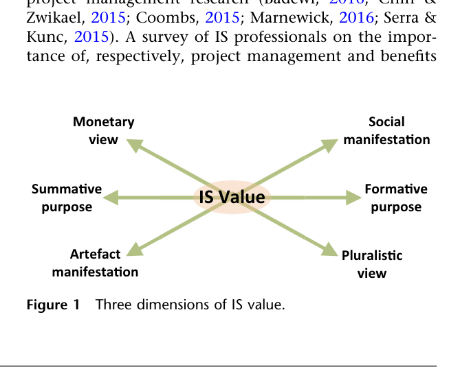
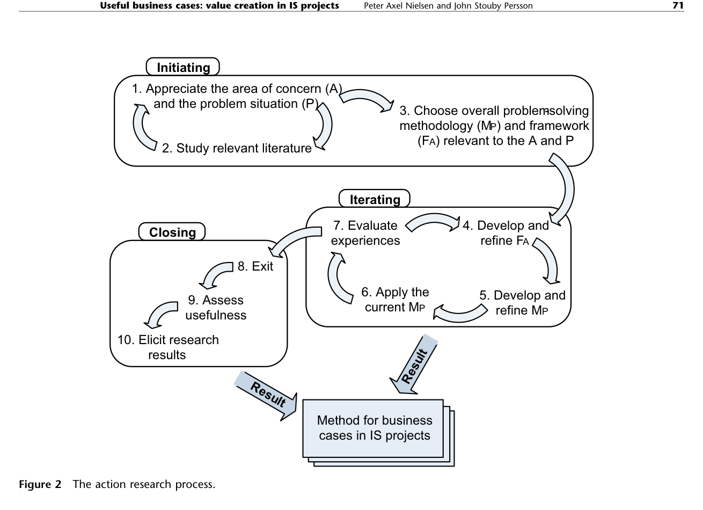
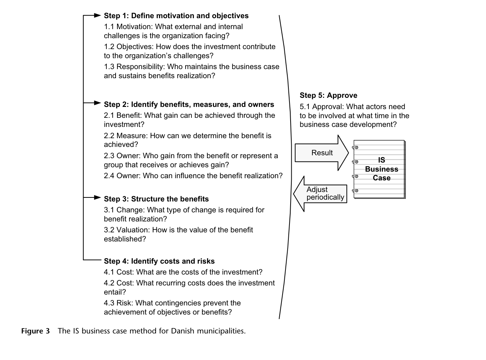
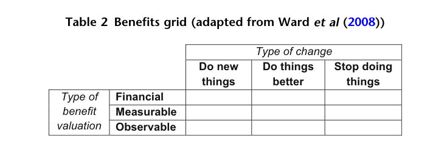
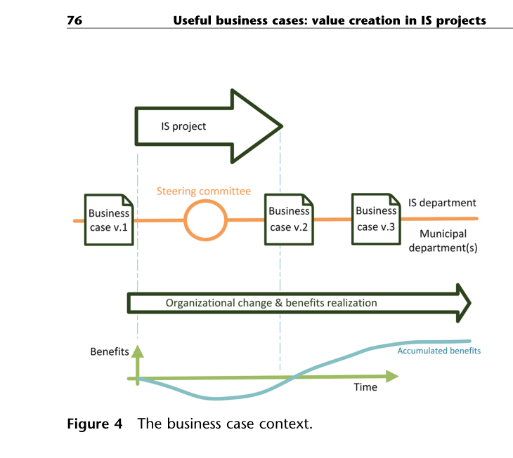

# Nielsen & Persson (2017) – Useful business cases: value creation in IS projects

**Kilde:** Peter Axel Nielsen & John Stouby Persson (2017), *European Journal of Information Systems*, 26(1), **s. 66–83**. Sidetal her er artiklens trykte sidetal (PDF-side = trykt side minus 65).

## Hovedidé

En **business case** bør være et brugbart styringsredskab for værdiskabelse **før, under og efter** et informationssystemprojekt, ikke bare et dokument til at få investeringen godkendt. Forskerne udviklede og vurderede en kort metode sammen med danske kommuner gennem *action research*. Deres tre hovedbidrag er: **minimalt nødvendigt indhold, social forpligtelse og dynamisk brug** (abstract; tabel 3, s. 80).

## Hvad betyder "værdi" her?

Artiklen fremhæver tre spændinger: **monetær ↔ pluralistisk værdi** (fx økonomi kontra kvalitet for borgere og medarbejdere), **summativ ↔ formativ brug** (bedømme et resultat kontra støtte fremtidige beslutninger) og **artefakt ↔ social manifestation** (systemets egenskaber kontra værdien der skabes i menneskers brug og organisatoriske ændringer). Man kan ikke reducere kommunal IT-værdi til én økonomisk størrelse (s. 67–69).

*Figur 1, s. 68.* Aksene er et sprog for, **hvilken slags værdi og anvendelse** en business case skal rumme. Der er flere legitime perspektiver på samme system; nogle kan komme i konflikt.

## Forskningsmetode og rækkevidde

Forskerne arbejdede sammen med **ti danske kommuner** i et større projekt, studerede eksisterende business cases og udviklede/afprøvede metoden gennem **12 workshops**. *Action research* betyder her, at forskere og praktikere både undersøger et problem og griber ind for at forbedre praksis. Metoden blev videreudviklet og vurderet af kommunale IS-ledere og projektledere (s. 70–74; tabel 1, s. 73). Resultaterne er særligt forankret i kommuners politiske og organisatoriske kontekst; metoden er et kvalificeret forslag, ikke en dokumentation for at den i sig selv garanterer gevinster.

*Figur 2, s. 71.* Forskerne diagnosticerer, udvikler en metode/forståelsesramme, anvender den, vurderer erfaringerne og reviderer den. Læg især mærke til **iteration** mellem metode, praksis og evaluering frem for ét afsluttet designforløb.

## Business case-metodens fem trin

1. **Motivation og mål:** Hvilke eksterne/interne udfordringer adresserer investeringen? Hvem vedligeholder business casen og gevinstarbejdet?
2. **Gevinster, mål og ejere:** Hvilke gevinster, hvordan konstateres de, hvem får dem, og hvem kan påvirke realiseringen?
3. **Strukturér gevinster:** Hvilken organisatorisk ændring er nødvendig, og hvordan vurderes gevinstens værdi?
4. **Omkostninger og risici:** Medtag både anskaffelse, løbende udgifter og forhold, der kan forhindre gevinster.
5. **Godkend:** Involvér relevante beslutningstagere og gevinstansvarlige; revidér business casen, når forudsætninger ændres.

*Figur 3 og forklaringer, s. 74–76.* Et **mål** for investeringen kan være fælles for organisationen, mens en **gevinst** kan tilhøre bestemte grupper. En gevinst bør knyttes til **et mål for opnåelse og en navngiven ejer** (s. 75–76).

### Benefits grid

I trin 3 placerer man hver gevinst efter **typen af forandring** (*do new things, do things better, stop doing things*) og **hvordan værdi kan dokumenteres** (*financial, measurable, observable*). *Observable* betyder ikke værdiløs eller umålelig; ejeren kan beskrive og dokumentere tegn på forbedring uden at gøre dem til et troværdigt pengebeløb (tabel 2; s. 75–76).

*Tabel 2, s. 75.* Brug gitteret til at spørge, om gevinsten fx kræver, at man **stopper en gammel rutine**, og om dokumentationen er økonomisk, kvantitativ eller kvalitativ. Gitteret giver også plads til gevinster som bedre sagsbehandling eller medarbejdertilfredshed (s. 76).

## Tre fund: indhold, relationer og løbende brug

| Fund | Hvorfor det er vigtigt |
| --- | --- |
| **Include minimal contents** | Et kort dokument med mål, gevinster, ejerskab, omkostninger og risici er lettere at bruge og ændre end omfattende skemaer, hvis ekstra indhold ikke hjælper beslutningerne. |
| **Develop social commitment** | Udpegning af ejere og forhandling med berørte ledere skaber ansvar for de ændringer, der skal skabe gevinsten. En underskrift alene er ikke hele forpligtelsen. |
| **Structure dynamic use** | Business casen skal leve videre gennem scoping, implementering, evaluering og reviderede beslutninger, fordi forhold og gevinster ændrer sig. |

*Tabel 3, s. 80; diskussion s. 77–79.* Et konkret problem i studiet var, at nogle projektledere nødigt ville lade linjeledere estimere gevinster, fordi realistiske estimater kunne gøre business casen mindre overbevisende. Men det er netop disse ledere, der ofte skal ændre praksis og levere gevinsterne (s. 78).

*Figur 4, s. 76.* Business casen ændres over tid, mens projektet, den organisatoriske forandring og ophobningen af gevinster fortsætter. Vær især opmærksom på, at business case version 1, 2 og 3 ikke betyder, at projektet fejlede; justering er en del af styringen.

## Brug i projektgruppen

Lav for hver foreslået ERP-gevinst en lille række: **gevinst → hvem oplever den → hvilket nyt/ændret/stoppet arbejde kræves → indikator → navngiven ejer → hvornår følger vi op?** Hvis ingen kan udpege ændringen eller ejeren, er gevinsten endnu kun et løfte. Det er en mulig anvendelse på jeres case, ikke et empirisk resultat fra den konkrete virksomhed.

## Lingo

- **IS value:** værdien af et informationssystem i dets organisatoriske sammenhæng.
- **Business case:** beslutnings- og styringsgrundlag for investeringen og dens gevinster.
- **Benefits grid:** matrix til at sortere gevinster efter ændringstype og dokumentation.
- **Social commitment:** aktører forpligter sig over for hinanden til at gennemføre og følge op på ændringer.
- **Dynamic use:** business casen vedligeholdes og anvendes under hele forløbet.
- **Action research:** forskning gennem samarbejdende handling, evaluering og justering.

**Relateret:** [[Ashurst-et-al-2008-Benefits-Realization-Capability]] giver den bredere organisatoriske model; [[Mitra-et-al-2011-Measuring-IT-Performance]] hjælper med at vælge og kommunikere målinger.
