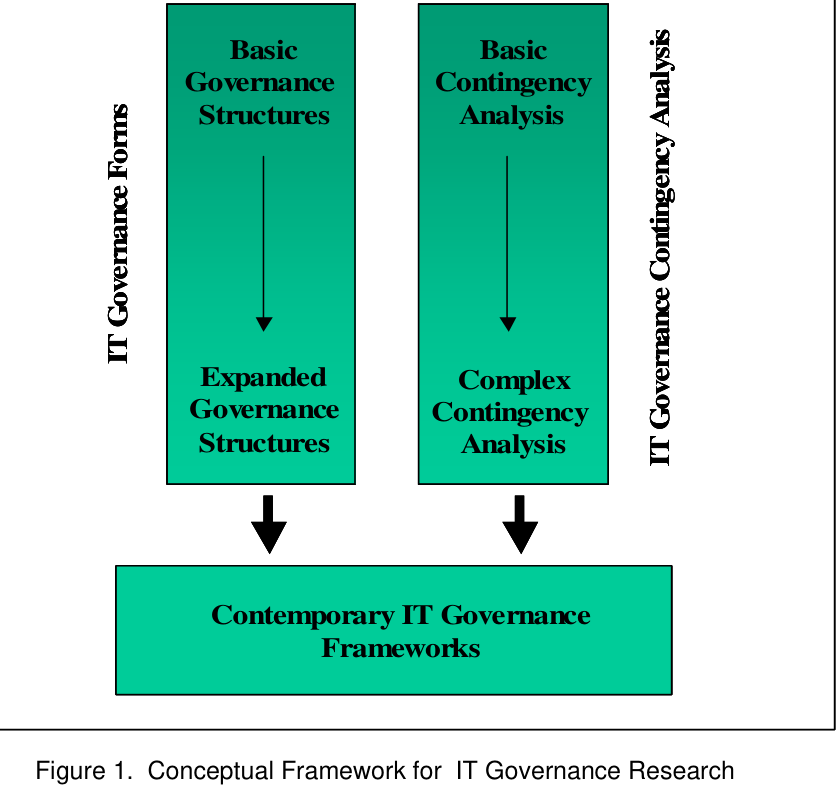

# Brown & Grant (2005) – Framing the Frameworks: A Review of IT Governance Research

**Reference:** Allen E. Brown & Gerald G. Grant (2005). *Framing the Frameworks: A Review of IT Governance Research*. Communications of the Association for Information Systems, 15, artikel 38, 696–712. DOI: 10.17705/1CAIS.01538.

**Sidehenvisninger:** Trykte artikelsider. S. 696 er PDF-side 2; fx s. 700 er PDF-side 6.

## Kort fortalt

Artiklen er et **litteraturreview**, som ordner forskning om IT-governance i to spor:

1. **IT governance forms:** Hvilke former kan fordelingen af beslutningsrettigheder have?
2. **IT governance contingency analysis:** Hvilke forhold forklarer, at en bestemt form passer bedre i en bestemt organisation?

Forfatterne argumenterer for, at Weill & Ross' daværende framework samler bidrag fra begge spor. Pointen er derfor både at forstå **mulige strukturer** og **deres pasform til konteksten** (s. 699–700, 706–709).

> [!important] “Contemporary”
> **Contemporary** betyder her samtidige eller nyere frameworks **på artiklens tidspunkt i 2005**. Det er ikke en påstand om, at reviewet dækker den nyeste forskning i dag.

## 1. Governance var et emne før ordet blev almindeligt

Tidligere forskning brugte bl.a. begreber som *locus of IT decision making*, *IS organizational structure* og *location of IS responsibility*. De behandlede spørgsmål, som senere blev samlet under IT-governance: hvem der beslutter, hvem der bidrager med input, og hvilke kontrolmekanismer der findes (s. 697–698).

**Locus** betyder placering: hvor i organisationen beslutningsmyndigheden ligger. Governance handler dermed om fordelingen af autoritet og ansvar omkring IT-beslutninger; selve valget og gennemførelsen af en konkret teknisk løsning foregår inden for disse rammer (s. 697–698).

## 2. Figur 1: Reviewets samlede ramme

*Figur 1, s. 700.* Venstre spor går fra simple til udvidede governance-former. Højre spor går fra simple til komplekse analyser af kontekst og pasform. De mødes i **contemporary IT governance frameworks**.

**Sådan skal figuren forstås:** Den klassificerer **forskningens udvikling**. Den er ikke en modenhedsmodel, som en virksomhed nødvendigvis bevæger sig igennem, og pilene er ikke statistisk testede årsagssammenhænge.

## 3. Spor 1: IT governance forms

### Grundskellet: centralt og decentralt

| Form | Beslutningsmyndighed | Typisk fordel | Typisk spænding |
| --- | --- | --- | --- |
| **Centralized** | Centralt IT-/IS-organ eller ledelse. | Fælles standarder, kontrol og stordriftsfordele. | Lokale behov kan få mindre plads. |
| **Decentralized** | De enkelte forretningsenheder eller processer. | Tilpasning og hurtig respons på lokale behov. | Samordning, genbrug og ensartethed kan blive vanskeligere. |

*Fordele og afvejninger diskuteres på s. 700–702.* Forskningssporet udviklede sig, fordi denne enten/eller-opdeling var for enkel til virkelige organisationer.

### Vertikal udvidelse: flere typer og grader

**Vertical expansion** betyder her, at klassifikationen af governance-former bliver mere detaljeret. Det betyder ikke blot flere ledelseslag. Reviewet fremhæver tre måder (s. 701–702):

- **Continuous classification:** grader af centralisering på et kontinuum.
- **Discrete nominal classification:** særskilte kategorier, fx en føderal/hybrid form.
- **Redefinition of extremes:** mere præcis identifikation af, hvem “centralt” og “decentralt” faktisk omfatter, fx linjeledere versus IT-ledere.

**Federal/hybrid governance** kombinerer typisk fælles retning eller kerneservices med lokalt råderum. Reviewet viser også, at lignende ord bruges forskelligt i litteraturen. Man skal derfor altid kontrollere den konkrete definition (s. 702).

### Horisontal udvidelse: flere typer beslutninger

**Horizontal expansion** betyder, at man undersøger governance særskilt for forskellige IT-opgaver eller beslutninger frem for at give hele virksomheden én mærkat. Drift, udvikling, planlægning og brug af IT behøver ikke have samme fordeling af myndighed (s. 702–703).

**Eget eksempel:** Fælles beslutninger om ERP-platform og stamdata kan kombineres med lokalt råderum over arbejdsgange. Det viser, hvorfor organisationens governance ikke kan beskrives dækkende med én samlet centraliseringsgrad.

**Tabel 1, s. 701** er en litteraturoversigt over disse undergrupper og de centrale studier. Dens funktion er at dokumentere reviewets opdeling; den er ikke et selvstændigt beslutningsværktøj.

## 4. Spor 2: Contingency analysis

**Contingency** betyder et kontekstforhold, som et passende governance-design afhænger af. Grundtanken er, at en universelt bedste governance-struktur ikke findes (s. 703).

### Fra enkeltfaktorer til samspil

Tidlig forskning undersøgte bl.a. organisationsstruktur, strategi, branche og størrelse. **Tabel 2, s. 704** samler forskning i sådanne ikke-interagerende faktorer. Resultaterne var ikke entydige: fx kunne størrelse og branche ikke konsekvent forklare governance-valget, og konklusioner kunne afhænge af, om størrelse måltes ved omsætning eller antal ansatte (s. 703–704).

Senere undersøgelser analyserede flere faktorer, som kunne **forstærke, modsige eller dominere hinanden**. Artiklen fremhæver *reinforcing, conflicting and dominating contingencies* fra Sambamurthy & Zmud (s. 705–706).

| Forhold mellem faktorer | Enkel forklaring | Eget eksempel |
| --- | --- | --- |
| **Reinforcing** | Flere hensyn peger i samme retning. | Fælles processer og ønske om genbrug taler begge for fælles standarder. |
| **Conflicting** | Hensyn peger i forskellige retninger. | Omkostningsbesparelser taler for fælles systemer, lokale kundebehov for særtilpasning. |
| **Dominating** | Ét hensyn vejer tungere end andre. | Et ufravigeligt sikkerhedskrav begrænser ellers ønsket lokalt råderum. |

### Uniform og non-uniform governance

- **Uniform:** én overordnet ordning anvendes på tværs af organisationen.
- **Non-uniform:** forskellige forretningsenheder eller IT-serviceområder har forskellige governance-ordninger.

Det sidste øger kompleksiteten: analysen skal både forstå konteksten for den enkelte enhed og den samlede organisation (s. 703, 705–706). **Hybrid governance design** kan betegne én blandet ordning anvendt overalt; **hybrid IS governance framework** bruges i den omtalte Brown-undersøgelse om flere forskellige designs på tværs af enheder (s. 705). De to formuleringer er derfor ikke automatisk identiske.

## 5. Hvorfor Weill & Ross forbinder sporene

Weill & Ross kombinerer seks arketyper med fem beslutningsområder. Det viderefører **forms-sporet**: forskellige beslutningstagere kan styre forskellige beslutningstyper. Samtidig forbindes designet med strategi, performance-mål, organisationsstruktur, erfaring, størrelse/diversitet og branche/region. Det viderefører **contingency-sporet** (s. 706–708).

> [!note] En tekstlig unøjagtighed
> På s. 707 kommer formuleringen “IT decisions” med i opremsningen af de fem områder. Det er en overordnet betegnelse, ikke et sjette særskilt område. De fem er principles, architecture, infrastructure strategies, business application needs samt investment/prioritization; se også Weill & Ross' matrix.

Reviewet fremstiller samlingen som en **begyndende syntese**, ikke som et endeligt løst problem. Forfatterne efterlyser fortsat empirisk forskning og nævner bl.a. kultur, politik og muligheden for at tænke governance ud over organisationsstrukturen (s. 708–709).

## 6. Metode og kritisk læsning

Reviewet byggede et indledende materiale på **over 200 artikler**, søgte bl.a. i Business Source Premier og brugte Web of Science til citationsanalyse. De udvalgte efter relevans, citationer og betydning. Organiseringen er **concept-centric** efter Webster & Watson: litteraturen samles omkring begreber og forskningsspor frem for en forfatter-for-forfatter-opremsning (s. 698–699).

En styrke er overblikket over begreber og forskningstraditioner. En begrænsning er, at reviewets hovedprodukt er en fortolkende klassifikation; det tester ikke selv, hvilken governance-struktur der giver bedst performance i en ny organisation. Vægt på citationer kan desuden favorisere etablerede perspektiver — en kritisk læseobservation, ikke et fund forfatterne demonstrerer.

## Brug til jeres case

**Egen anvendelse:** Stil to forskellige spørgsmål: **Hvordan fordeles ERP-beslutningerne?** og **hvorfor giver denne fordeling mening eller problemer i netop denne virksomhed?** Det første beskriver formen; det andet undersøger kontekst, mål og fit. Høj lokal autonomi er ikke i sig selv evidens for dårlig governance, men kan skabe problemer, hvis fælles processer kræver ensartethed.

## Lingo og selvtest

- **Framework:** ramme til at strukturere analyse eller handling.
- **Fit:** pasform mellem design og de forhold, det skal fungere under.
- **Antecedent:** et forudgående forhold, som tænkes at forklare et valg eller resultat.
- **Contingency:** en betingelse, som et hensigtsmæssigt design afhænger af.
- **Amalgamation:** sammenføjning; her syntesen af to forskningstraditioner.
- **Contemporary:** samtidig/nutidig relativt til tekstens udgivelsestidspunkt.

**Kan du forklare:** Hvad er forskellen på vertikal og horisontal udvidelse? Hvorfor er forms og contingency to forskellige spørgsmål? Hvorfor er figur 1 ikke en virksomheds modenhedsmodel?

**Sammenhæng:** [[Weill-Ross-2005-A-Matrixed-Approach]] gør syntesen praktisk med en governance-matrix. [[Singh-et-al-2020-Ambidextrous-Governance]] tilføjer et tydeligt tids- og forandringsperspektiv.
