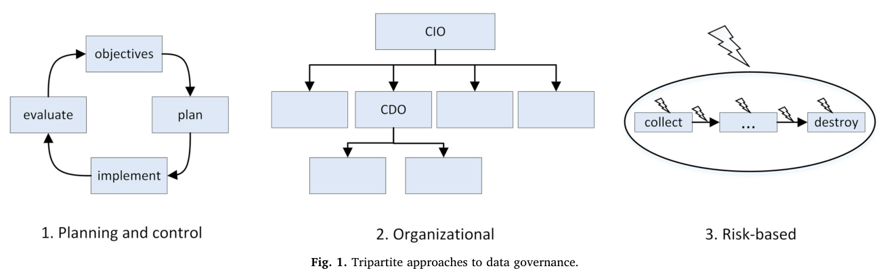
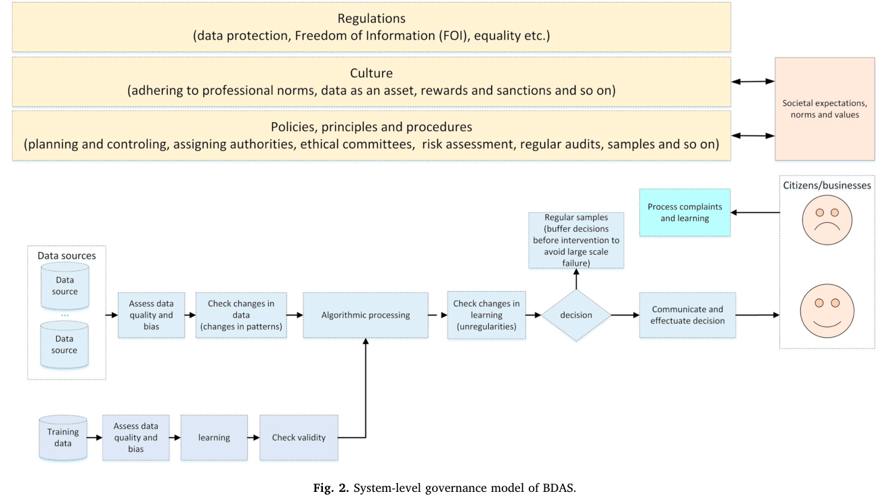

# Janssen et al. (2020) – Data governance: Organizing data for trustworthy Artificial Intelligence

**Reference:** Marijn Janssen, Paul Brous, Elsa Estevez, Luis S. Barbosa & Tomasz Janowski (2020). *Government Information Quarterly*, 37, 101493. DOI: 10.1016/j.giq.2020.101493.

**Sidehenvisninger:** Artiklens sider 1–8 svarer til PDF-siderne. Teksten opstiller en konceptuel ramme og designprincipper; den rapporterer ikke et selvstændigt empirisk casestudie, som tester hele rammen.

## Kort fortalt

AI-systemers pålidelighed afhænger af, hvordan **data, algoritmer, mennesker og ansvar organiseres gennem hele livscyklussen**. Fejlbehæftede eller skæve data kan give systematiske fejl i beslutninger, og ansvaret kan blive uklart, når data krydser afdelinger og organisationer. Artiklen foreslår derfor governance på **systemniveau**, understøttet af data stewardship, pålidelig datadeling og 13 principper (s. 1–2, 4–7).

> [!important] Hovedpointe
> At åbne algoritmens kode for inspektion løser ikke alene problemet. Man må også kontrollere dataenes oprindelse og kvalitet, anvendelsen af algoritmen, resultaterne, klagemulighederne og ansvarsfordelingen.

## 1. Begreberne fra begyndelsen

| Begreb | Enkel forklaring |
| --- | --- |
| **BOLD** | *Big, Open and Linked Data*: store datamængder, åbne data og sammenkoblede data. |
| **BDAS** | *Big Data Algorithmic Systems*: systemer, som behandler store datamængder algoritmisk og ofte bruger AI. |
| **FAT** | *Fair, Accountable and Transparent*: fair, ansvarlige og transparente algoritmer. |
| **Data governance** | Regler, autoritet, ansvar og opfølgning for data og algoritmer inden for og mellem organisationer. |
| **Trustworthiness** | Egenskaber, som gør det berettiget at betro systemet en opgave og stole på, at det varetager relevante interesser. |
| **Data quality** | Om data er egnede til den konkrete anvendelse, bl.a. mht. korrekthed, aktualitet, fuldstændighed og relevans. |
| **Bias** | Systematisk skævhed i data, behandling eller resultater. Flere data fjerner ikke nødvendigvis skævheden. |

*Kilde: s. 1–3.* BDAS er en systemkategori; det er ikke navnet på en bestemt model eller algoritme.

## 2. Governance, governing og management

Artiklen skelner mellem tre nært beslægtede begreber (s. 2):

- **Governance:** den organiserende logik og ramme, som bestemmer myndighed, ansvar og brug af data.
- **Governing:** aktiviteterne, der etablerer og udøver denne styring.
- **Data management:** håndteringen af data, fx indsamling, lagring, behandling, deling og sletning.

**Eget eksempel:** At vedligeholde en kundepost er data management. At fastlægge, hvem der må ændre den, hvem der skal rette fejl, og hvad den må bruges til, er governance. Reglerne skal også anvendes og følges op i praksis.

Data governance må dække både data **og algoritmer**, fordi begge ændrer sig over tid, og begge påvirker systemets beslutninger (s. 2–3).

## 3. Hvorfor er det vanskeligt?

Data følger ikke nødvendigvis organisationsdiagrammet. En oplysning kan indsamles ét sted, ændres et andet og indgå i en beslutning et tredje. Resultatet kan være datasiloer, dubletter, uklar ansvarlighed og manglende kontrol med hele forløbet (s. 2–3).

**Interoperabilitet** gør datadeling lettere, men kan også sprede ukorrekte oplysninger hurtigt. En adresse kan fx være korrekt ved indsamling og senere blive forældet. Ved sammenkobling af datasæt opstår desuden *entity resolution*: at afgøre, hvilke poster der henviser til den samme person eller enhed (s. 2).

Et centralt problem er dermed både **fitness for use** og **accountability**: Er data egnede til netop denne beslutning, og hvem skal stå til ansvar, hvis noget går galt?

## 4. Figur 1: Tre supplerende governance-tilgange

*Figur 1, s. 3.* De tre tilgange er:

| Tilgang | Hvad den fokuserer på | Typiske greb |
| --- | --- | --- |
| **Planning and control** | Mål, planer, budgetter, implementering og evaluering. | Gentagelige procedurer, opfølgning og audit. |
| **Organizational** | Roller, struktur, mandat og ansvar. | Dataansvarlige, data stewards, komitéer og ledelsesroller. |
| **Risk-based** | Konkrete risici gennem dataenes og algoritmernes livscyklus. | Risikovurdering, kontrol af kvalitet/bias og forebyggende eller opdagende kontrol. |

Pilene i venstre del viser en planlægningscyklus; organisationsdiagrammet i midten viser rollefordeling; lynene til højre illustrerer risici ved forskellige trin fra indsamling til sletning. **Tilgangene kan kombineres**. For meget governance kan give unødigt besvær, mens for lidt kan efterlade risiko og ansvar uklart (s. 3–4).

## 5. Figur 2: Governance på systemniveau

*Figur 2, s. 4; forklaring s. 4–5.* Figuren skal læses i flere lag:

1. **Øverst:** regler, kultur, politikker, principper og procedurer sætter rammerne. Samfundets forventninger og værdier indgår også.
2. **Nederst til venstre:** træningsdata kontrolleres, algoritmen lærer, og resultaternes gyldighed undersøges.
3. **Gennem midten:** inputdata kontrolleres for kvalitet og bias; ændrede datamønstre og generalisering vurderes; algoritmen behandler data og støtter en beslutning.
4. **Til højre:** resultater påvirker borgere og virksomheder. Klager, stikprøver og læring giver mulighed for at undersøge og korrigere systemet.

**Kontrollerne skal gælde input, behandling og output.** Et system kan være trænet på historiske data, som ikke passer til en ny situation. Derfor må man reagere på ændringer i data og resultater — ikke blot godkende modellen én gang (s. 5).

### Begreber knyttet til modellen

- **Black box / white box:** graden af indsigt i, hvordan input fører til resultat. Artiklen argumenterer for forklarlighed og mulighed for at undersøge beslutninger.
- **False positive:** systemet markerer noget som til stede, selv om det ikke er det; fx en fejlagtig mistanke om svig. **False negative** er en overset faktisk hændelse. Eksemplet er eget.
- **Compliance-by-design:** relevante krav bygges ind i systemets design og anvendelse.
- **Auditability:** muligheden for at efterprøve systemet og dets brug.
- **Controlled scrutiny:** kontrolleret adgang for kvalificerede aktører til at undersøge data, algoritmer og processer.

*Begreber og argumenter: s. 4–5.* Artiklen foreslår kontrolleret åbenhed, bl.a. fordi fuld offentliggørelse kan eksponere sårbarheder, og fordi mange borgere ikke selv kan efterprøve kompleks kode. Transparens skal derfor ledsages af praktisk mulighed for tilsyn og ansvarliggørelse.

## 6. Data stewardship og base registries

**Data stewardship** handler om ansvarlig forvaltning af data på andres vegne. Flere kan have interesser i samme data, så et simpelt “hvem ejer data?”-spørgsmål kan være utilstrækkeligt. Stewards skal medvirke til kvalitet, gyldighed, sikkerhed og ansvarlig deling (s. 5).

Et **base registry** er en betroet, autoritativ datakilde, hvor en organisation har ansvar for indsamling, brug, ajourføring og bevaring, og andre kan genbruge oplysningerne. Fejl skal kunne meldes tilbage til den ansvarlige kilde. Det mindsker behovet for ukontrollerede kopier (s. 5–6).

**Spændingen mellem stewardship og usefulness:** Beskyttelse kan begrænse nyttig deling, mens et stærkt ønske om genbrug kan skade beskyttelsen. God governance må håndtere begge hensyn (s. 5).

## 7. Betroet datadeling på tværs af organisationer

Et **trusted data-sharing framework** indeholder aftaler og mekanismer for, hvem der må dele hvilke data, til hvilke formål og under hvilke betingelser. Ansvarsfordelingen kan ikke stoppe ved organisationsgrænsen, når systemet bruger eksterne datakilder (s. 6).

| Begreb | Spørgsmål det besvarer |
| --- | --- |
| **Identification** | Hvem hævder du at være? |
| **Authentication** | Kan den påståede identitet bekræftes? |
| **Authorization** | Hvilke data og handlinger har du ret til at tilgå? |
| **Non-repudiation** | Kan oprindelsen dokumenteres, så afsenderen ikke uden videre kan benægte den? |
| **Self-sovereign identity (SSI)** | Hvordan kan personer få kontrol over identitetsdata og delingen af dem? |

*Kilde: s. 6.* SSI og distribuerede registre diskuteres som mulige dele af sådanne løsninger. Teknologien ophæver ikke behovet for fælles regler, ansvar og kontrol.

**Need to know:** Del kun det, der er nødvendigt for formålet. Artiklens eksempel er at svare på, om en person opfylder en aldersgrænse, frem for at udlevere de underliggende detaljer om alder eller fødselsdato (s. 6).

## 8. De 13 principper

**Tabel 1, s. 7** samler principperne. Her er de gengivet i korte danske forklaringer:

| Nr. | Originalt navn | Hvad du skal forstå |
| --- | --- | --- |
| 1 | Evaluate data quality and bias | Undersøg datakvalitet og indlejrede skævheder. |
| 2 | Detect changing patterns | Undersøg ændrede resultater og datamønstre; kontrollér gyldigheden igen. |
| 3 | Need to know | Del den mindste nødvendige information. |
| 4 | Bug bounty | Skab incitamenter til at opdage og rapportere fejl. |
| 5 | Inform when sharing | Gør berørte personer/organisationer opmærksomme på deling. |
| 6 | Data separation | Adskil personlige og ikke-personlige samt følsomme og ikke-følsomme data. |
| 7 | Citizens control of data | Giv borgere og organisationer indsigt og mulighed for at kontrollere korrektheden. |
| 8 | Collecting data at the source | Indsaml ved kilden, og kend indsamlingsgrundlaget. |
| 9 | Minimize authorization to access data | Giv kun adgang ved et reelt behov. |
| 10 | Distributed storage of data | Fordel lagring med henblik på mindre sårbarhed og færre uberettigede sammenkoblinger. |
| 11 | Data stewards | Placér formelt ansvar for dataforvaltning. |
| 12 | Separations of concerns | Fordel ansvar, så én aktør ikke alene kan misbruge data. |
| 13 | Usefulness | Behandl data som et aktiv med potentiale for værdifuld anvendelse. |

> [!note] Antallet i originalen
> Abstract og tabellen angiver **13 principper**. Løbeteksten på s. 7 siger ét sted “12”; tabellen indeholder faktisk 13. Principperne er forfatternes designforslag, ikke en gengivelse af 13 gældende lovkrav.

## 9. Hvad kan artiklen bruges til — og hvad viser den ikke?

Artiklen giver et sprog for at analysere organisering af data og AI: roller, dataflow, tilsyn, deling, kontrol og feedback. Den fremhæver selv manglen på etablerede gode praksisser og behovet for mere forskning, især om trusted frameworks og SSI (s. 7).

**Kritisk læsning:** Principper som distribueret lagring er foreslåede designvalg; de bør ikke læses som en garanti for sikkerhed uanset implementering. Rammen er et argumenteret forslag, ikke en eksperimentelt valideret opskrift på fejlfri AI.

## Brug til jeres case

**Egen anvendelse på ERP:** Selvom casen ikke bruger AI, kan I følge et vigtigt dataelement — fx leveringstid eller produktstamdata — fra registrering til beslutning. Hvem opretter det, hvem retter fejl, hvem genbruger det, og hvem opdager uoverensstemmelser? Datakvalitet er dermed også et spørgsmål om roller og arbejdspraksis.

## Selvtest

1. Hvorfor omfatter data governance også algoritmer og output?
2. Hvordan adskiller data stewardship sig fra en simpel forestilling om ejerskab?
3. Hvorfor er åben kode ikke tilstrækkelig til at sikre accountability?
4. Hvad er forskellen på authentication og authorization?

**Sammenhæng:** [[Weill-Ross-2005-A-Matrixed-Approach]] hjælper med at kortlægge beslutningsrettigheder; Janssen et al. udvider opmærksomheden til data- og algoritmelivscyklusser på tværs af organisationer.
