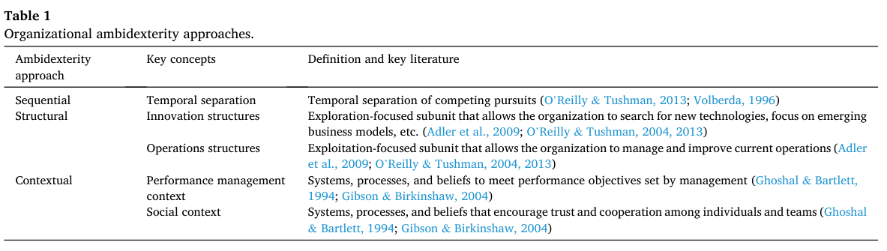
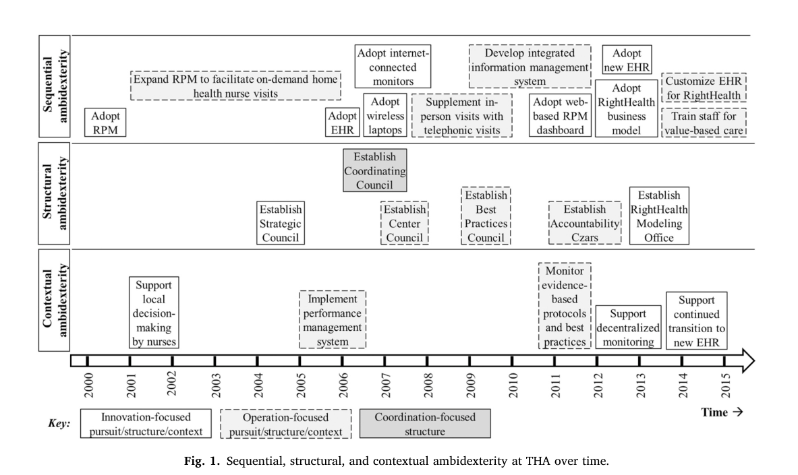
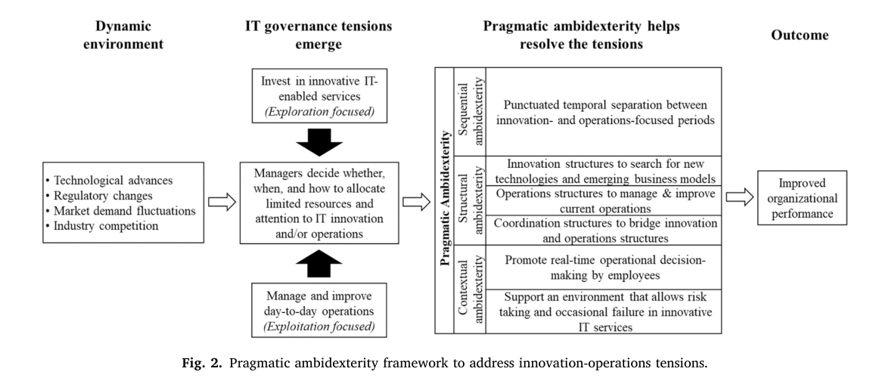

# Singh, Baird & Mathiassen (2020) – Ambidextrous governance of IT-enabled services: A pragmatic approach

**Reference:** Rajendra Singh, Aaron Baird & Lars Mathiassen (2020). *Information and Organization*, 30, 100325. DOI: 10.1016/j.infoandorg.2020.100325.

**Sidehenvisninger:** Artiklens egne sider 1–14, som svarer til PDF-siderne. Brødteksten slutter på s. 11; derefter følger bl.a. appendiks og referencer.

## Kort fortalt

Organisationer skal både udvikle nye IT-understøttede services og holde de eksisterende services i gang. Det skaber en **innovation-operation tension**: begrænsede ressourcer og opmærksomhed skal fordeles mellem fremtidig fornyelse og nuværende drift (s. 1–2).

Artiklens bidrag er, at **sequential, structural og contextual ambidexterity kan kombineres og ændres over tid**. Ledelsen behøver ikke finde én permanent “balance” eller vælge én af de tre former for altid. Den skal løbende beslutte, hvilke greb der passer til den konkrete situation, og skabe forbindelser mellem innovation og drift (s. 9–11).

> [!important] Ambidexterity betyder ikke 50/50
> Det er evnen til at håndtere konkurrerende hensyn. I casen var der korte perioder med innovationsfokus og længere perioder med fokus på drift, samtidig med at organisatoriske strukturer og medarbejdernes råderum understøttede begge hensyn.

## 1. Lingo: hvad konkurrerer om ressourcerne?

| Begreb | Betydning i artiklen | Eget ERP-eksempel |
| --- | --- | --- |
| **IT-enabled services** | Ydelser, hvis levering og udvikling understøttes af IT. | Ordrebehandling, planlægning eller leveringsinformation, som afhænger af ERP. |
| **Exploration** | Søge, afprøve og udvikle nye muligheder. | Afprøve en ny digital planlægningsproces. |
| **Exploitation** | Udnytte og forbedre eksisterende kapabiliteter, rutiner og løsninger. | Gøre den nuværende planlægningsproces mere stabil og effektiv. |
| **Ambidexterity** | Evne til at håndtere både exploration og exploitation. | Forbedre driften og samtidig skabe plads til nye løsninger. |
| **Trade-off** | Et valg, hvor mere af ét hensyn kan koste noget på et andet. | Pilotarbejde tager tid fra den daglige produktion. |

*Begreberne udfoldes på s. 3–4. Eksemplerne er egne.* **Exploitation** betyder her udnyttelse/videreudvikling af det eksisterende og har ikke nødvendigvis en negativ betydning. Innovation og exploration ligger tæt i artiklen, ligesom drift og exploitation, men incremental forbedring kan også foregå i driften.

## 2. De tre former for ambidexterity

| Form | Hvordan håndteres spændingen? | Hvad ledelsen må etablere |
| --- | --- | --- |
| **Sequential** | Skiftende fokus over tid: først mere innovation, derefter mere udnyttelse og stabilisering. | Prioritering af perioder, overgange og ressourcer. |
| **Structural** | Forskellige enheder, råd eller roller fokuserer på innovation og drift parallelt. | Specialisering samt koordinering mellem delene. |
| **Contextual** | Medarbejdere og teams kan i hverdagen vurdere, hvordan de fordeler deres indsats mellem hensynene. | Både performancekrav og social støtte, tillid, læring og beslutningsrum. |

*Kilde: tabel 1, s. 3 og forklaring s. 3–4.*

**Contextual** betyder ikke blot “afhængig af situationen”. Det betegner en organisatorisk kontekst, hvor styringssystemer, processer, normer og relationer gør medarbejdernes løbende afvejninger mulige. Det er heller ikke fravær af ledelse: ledelsen designer rammerne for råderummet (s. 4).

## 3. Casen: remote patient monitoring hos THA

Studiet følger en amerikansk organisation, **THA**, som leverer hjemmebaserede sundhedsydelser. **Remote patient monitoring (RPM)** betyder, at målinger fra patientens hjem sendes elektronisk til sundhedspersonale. Sygeplejersker kan derfor tilpasse indsatsen til ændringer i patientens tilstand frem for kun at følge faste besøgsplaner (s. 5).

Organisationen påvirkes af teknologisk udvikling, ændringer i efterspørgsel og ændrede afregnings-/reguleringsvilkår. Det ændrer både, hvilke løsninger der er mulige, og hvad der er økonomisk og klinisk nødvendigt. Læs reguleringsforløbet som **casens historiske amerikanske kontekst**, ikke som en nutidig dansk regelbeskrivelse (s. 5).

### Forskningsdesign

- En kvalitativ **single-case study** med flere *embedded units of analysis*: initiativer, strukturer, ansatte, processer og teknologi inden for THA.
- **Purposive sampling:** THA blev valgt, fordi organisationen var en tidlig og erfaren bruger af RPM.
- Første runde i **2009:** 25 semistrukturerede interview, 9 feltobservationer, besøg ved 2 centralstationer samt dokumenter og demonstrationer.
- Anden runde i **2015:** 6 opfølgende interview med ledere samt yderligere dokumenter.
- Retrospektiv analyse af et forløb på cirka **15 år**, suppleret med enkelte performanceindikatorer.

*Kilde: s. 5–6.* Der er altså ikke tale om 15 års uafbrudt observation. Forskerne rekonstruerer udviklingen gennem data indsamlet på forskellige tidspunkter.

## 4. Hvad viste casen?

### Sequential: innovation i korte perioder, drift i længere perioder

**Tabel 2, s. 6 og analysen s. 7** beskriver dette mønster:

| Periode | Primært fokus | Eksempel |
| --- | --- | --- |
| 2000–2001 | Innovation | Introducere RPM som del af hjemmeplejen. |
| 2001–2006 | Drift | Udvide og stabilisere brugen af monitorer og centralstationer. |
| 2006–2007 | Innovation | EHR, trådløse laptops og internetforbundne monitorer. |
| 2007–2012 | Drift | Forfine serviceprocesser og informationsdeling. |
| 2012–2013 | Innovation | Web-dashboard, nyt EHR og RightHealth-forretningsmodel. |
| 2013–2015 | Drift | Tilpasse løsninger og oplære medarbejdere i den nye model. |

**Punctuated equilibrium** bruges til at forstå korte forandringsperioder mellem længere perioder med udnyttelse og forbedring. Det betyder ikke, at al drift stopper i innovationsperioderne, eller at ingen forbedringer sker mellem dem (s. 7, 9).

### Structural: specialisering skabte et behov for forbindelser

THA etablerede **innovationsstrukturer** som Strategic Council og RightHealth Modeling Office samt **driftsstrukturer** som Best Practices Council og roller med ansvar for performance og kvalitet. Opdelingen gav dog problemer med informationsdeling og uklare tværgående roller. Et **Coordinating Council** skulle forbinde dem gennem informationsudveksling, ressourcer, retning og opfølgning (s. 7–8; tabel 3, s. 8).

> [!important] Artiklens bidrag
> Man får ikke automatisk integration ved at oprette en innovationsenhed og en driftsenhed. Artiklen fremhæver betydningen af en **coordination structure**, der gør overgangen mellem idé, pilot og daglig anvendelse mulig.

### Contextual: performancekrav og social støtte

THA ændrede bl.a. performance management til fokus på **kvaliteten af plejen** frem for antal eller varighed af besøg. Samtidig fik sygeplejersker bedre information og rettigheder til selv at prioritere indsats. Social støtte bestod bl.a. i informationsdeling, involvering, læring og mulighed for at eksperimentere (s. 8–9; tabel 4, s. 9).

En EHR-overgang gav alvorlige praktiske vanskeligheder. Det tværgående råd inddrog medarbejderperspektiver og støttede fortsættelsen. Eksemplet viser et fælles beslutnings- og læringsmiljø; det er ikke en generel anbefaling om altid at fortsætte et problematisk projekt (s. 8).

## 5. Figur 1: Se de tre former over samme tidslinje

*Figur 1, s. 9.* Øverste bånd viser perioder/aktiviteter, det midterste viser strukturer, og det nederste viser kontekst. Pointen er at læse **både hen langs tiden og på tværs af de tre bånd**: flere former kan fungere samtidig.

**Figurens markeringer:** Hele rammer angiver innovationsfokus, stiplede rammer driftsfokus og grå felter koordinationsstrukturer. Stiplede rammer betyder dermed ikke “svagere samarbejde” eller større usikkerhed; de har en specifik betydning i signaturforklaringen.

## 6. Figur 2: Den pragmatiske ramme

*Figur 2, s. 10.* Læs fra venstre:

1. Omgivelserne ændrer sig teknologisk, regulatorisk og markedsmæssigt.
2. Ledelsen må vælge **om, hvornår og hvordan** begrænsede ressourcer anvendes til innovation og drift.
3. En kombination af tidsmæssige, strukturelle og kontekstuelle greb hjælper med at håndtere spændingerne.
4. Det skal understøtte organisatorisk performance.

De sorte pile mod ledelsesboksen viser de konkurrerende innovations- og driftshensyn. Figuren foreslår en teoretisk sammenhæng baseret på casen; højre boks er ikke et løfte om forbedring i enhver organisation.

## 7. Hvad betyder “pragmatic”?

**Pragmatism** er her et forskningsperspektiv med fokus på **handlinger og deres virkninger i en konkret kontekst**. Forskerne fortolker, hvordan THA faktisk reagerede på udfordringer, frem for på forhånd at antage, at en bestemt balance eller én ambidexterity-form var den rigtige. “Pragmatisk” betyder derfor mere end bare “praktisk” eller “det, der er nemmest” (s. 4, 10–11).

## 8. Performance og metodisk forsigtighed

Antal sygeplejebesøg pr. 60-dages patientforløb faldt fra **8,5 i 2001 til 4,0 i 2013**. Andelen af hospitalsindlæggelser faldt fra **31,5 % i 2002 til 17,3 % i 2014**, og akut hjælp uden efterfølgende indlæggelse fra **24 % til 11,2 %** i samme periode (s. 6).

Forfatterne understreger, at tallene **ikke beviser en kausal effekt** af ambidexterity. Patienternes sygdomme, alder og andre forhold kan påvirke resultaterne, og studiet har ikke de patientdata, der kræves til at kontrollere dette (s. 6). Én case begrænser sammenligning på tværs, og retrospektive data giver risiko for **recall bias** — skævheder i erindringen. Flere datakilder, forskere og opfølgning bruges til at mindske problemet (s. 11).

## Brug til jeres case

**Egen anvendelse:** Ved ERP-forbedringer kan I spørge: Har medarbejderne afsat tid til at eksperimentere? Findes en rolle eller et forum, som forbinder forslag med stabil drift? Kan brugere træffe lokale beslutninger, og belønnes de samtidig på mål, som giver plads til forbedring? Undersøg samspillet mellem disse forhold frem for blot at spørge, om virksomheden “er ambidekstral”.

## Selvtest

1. Hvordan adskiller sequential, structural og contextual ambidexterity sig?
2. Hvorfor er et koordinerende råd vigtigt, når innovation og drift er opdelt?
3. Hvorfor er en fast 50/50-fordeling ikke artiklens hovedanbefaling?
4. Hvad kan den kvalitative case forklare, som de tre performanceindikatorer alene ikke kan bevise?

**Sammenhæng:** [[Weill-Ross-2005-A-Matrixed-Approach]] kortlægger mandat og mekanismer; Singh et al. viser, hvordan governance også skal tilpasses over tid.
