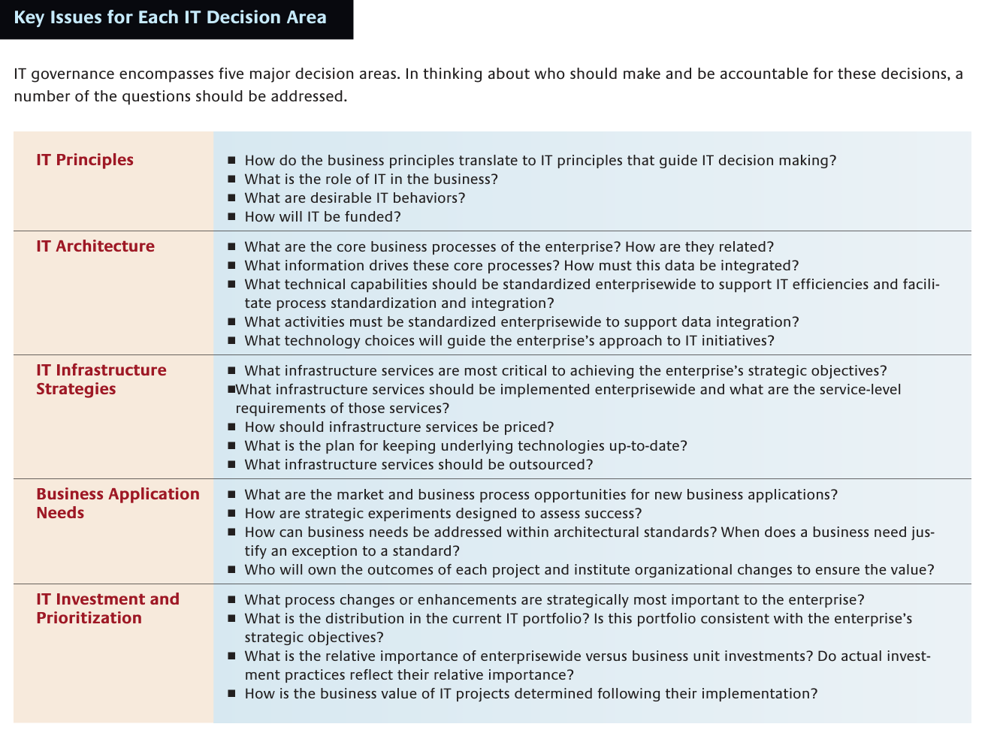
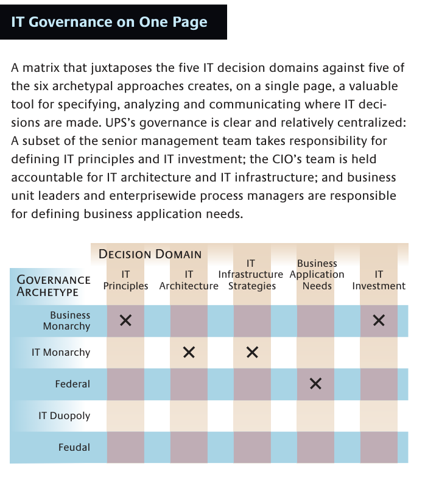
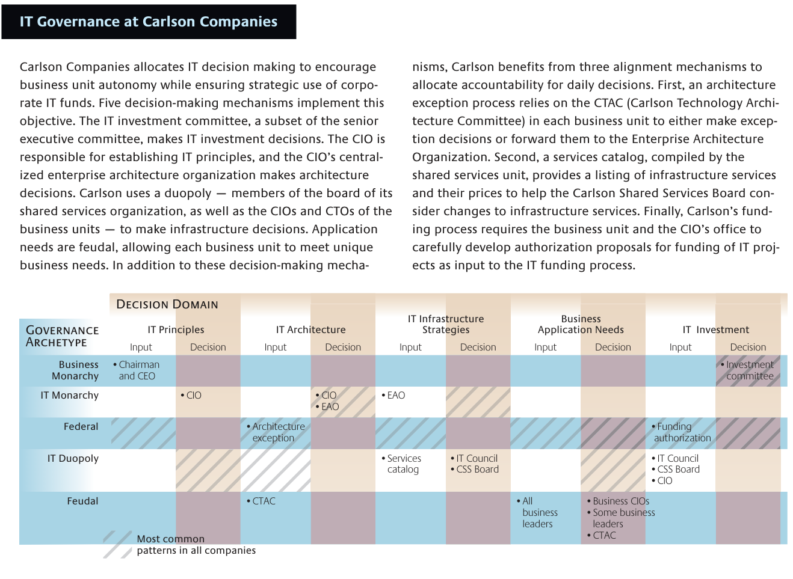
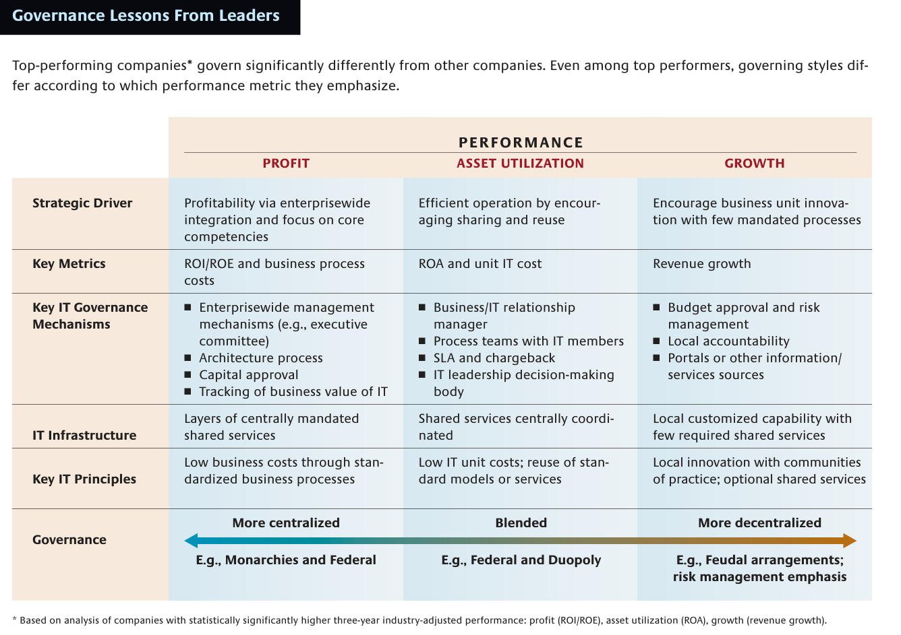

 
# Weill & Ross (2005) – A Matrixed Approach to Designing IT Governance

**Reference:** Peter Weill & Jeanne Ross (2005). *A Matrixed Approach to Designing IT Governance*. MIT Sloan Management Review, 46(2), 26–34.

**Sidehenvisninger:** Artiklens trykte sidetal. S. 26 er PDF-side 2, s. 31 er PDF-side 7 osv. Figurerne er ikke nummereret i originalen, så de identificeres med deres originale overskrifter.

## Kort fortalt

IT-governance handler om, **hvem der har ret til at træffe hvilke IT-beslutninger, hvem der bidrager med input, og hvem der holdes ansvarlig for resultaterne**. God governance kræver et bevidst design, som passer til virksomhedens mål og er kendt af dem, der skal bruge det. Der findes ikke én optimal struktur for alle virksomheder eller for alle IT-beslutninger (s. 26–29).

Artiklens vigtigste værktøj er en matrix, der kombinerer **fem beslutningsområder** med **seks governance-arketyper**. Den hjælper med at gøre et ofte uklart ansvar synligt på én side.

> [!important] Hvad skal du kunne forklare?
> Et firma kan lade topledelsen fastlægge IT's rolle, IT-afdelingen beslutte tekniske standarder og forretningsenhederne definere lokale systembehov. Derfor giver det ikke altid mening blot at kalde hele virksomheden “centraliseret” eller “decentraliseret”.

## 1. De fem beslutningsområder

| Originalt begreb | Forklaring | Tænkt eksempel |
| --- | --- | --- |
| **IT principles** | Overordnede beslutninger om IT's strategiske rolle og ønsket adfærd. | “Vi genbruger fælles systemer, hvor det understøtter forretningen.” |
| **IT architecture** | Sammenhængende tekniske valg og standarder, der skal opfylde forretningsbehov. | Fælles datadefinitioner, integrationsstandarder og arkitekturprincipper. |
| **IT infrastructure strategies** | Hvilke fælles IT-services virksomheden har brug for, med hvilke serviceniveauer og finansiering. | Netværk, identitetsstyring, platforme og fælles drift. |
| **Business application needs** | Hvilke forretningsbehov applikationer skal dække. | Hvilke funktioner produktionen har brug for i ERP. |
| **IT investment and prioritization** | Hvor meget der investeres, hvor pengene bruges, og hvilke projekter der prioriteres. | Om ERP-forbedringer skal prioriteres over et nyt CRM-system. |

*Kilde: s. 27 og oversigten på s. 30. Eksemplerne er egne illustrationer.*

**Arkitektur og infrastruktur er forskellige:** Arkitekturen sætter rammerne for tekniske valg og sammenhæng; infrastrukturen er de fælles services og kapabiliteter, som løsningerne bygger på. Et applikationsbehov er heller ikke automatisk en godkendt investering.

*“Key Issues for Each IT Decision Area”, s. 30.* Tabellen giver spørgsmål til at konkretisere hvert område. Bemærk især spørgsmålet under applikationsbehov om, **hvem der ejer projektets resultater og gennemfører de nødvendige organisatoriske ændringer**.

## 2. De seks arketyper: hvem beslutter?

| Arketype | Beslutningsret | Huskeregel |
| --- | --- | --- |
| **Business monarchy** | En eller flere seniorledere fra forretningen; CIO kan indgå. | Forretningens topledelse. |
| **IT monarchy** | IT-ledere eller IT-specialister med det formelle mandat. | IT bestemmer. |
| **Federal** | Fælles beslutninger på tværs af centrale ledere og forretningsenheder, med IT-involvering som beskrevet i artiklen. | Centralt og lokalt forhandler sammen. |
| **IT duopoly** | IT og én forretningspart/-gruppe deler beslutningsretten. | IT + forretning som to parter. |
| **Feudal** | Forretningsenheder eller procesejere beslutter hver for sig inden for deres område. | Hver enhed har sit eget råderum. |
| **Anarchy** | Enkeltbrugere eller små grupper træffer egne beslutninger. | Hver person eller lille gruppe følger sin egen IT-dagsorden. |

*Kilde: s. 27.* Arketyper beskriver **deltagerne og fordelingen af beslutningsretten**. De er ikke en rangordning fra dårlig til god governance.

**Federal versus duopoly:** Begge indebærer samarbejde, men en duopoly er en to-partsordning mellem IT og en forretningspart. Den føderale model samler centrale og lokale forretningsinteresser. “To personer på et møde” er derfor ikke en tilstrækkelig definition af duopoly.

## 3. Matrixen i praksis

*“IT Governance on One Page”, s. 31.* Læs **kolonnen** som beslutningsområdet og **rækken** som den gruppe, der har beslutningsretten. I UPS-eksemplet er placeringerne:

- **IT principles og investment:** business monarchy.
- **Architecture og infrastructure:** IT monarchy.
- **Business application needs:** federal, som markeret i figuren.

UPS kombinerer dermed central strategisk styring med involvering på flere organisatoriske niveauer (s. 27–28, 31). Matrixen på s. 31 viser kun fem arketyper; **anarchy** er med i tekstens fulde typologi, men udeladt her.

### Input er ikke det samme som beslutningsret

En person kan kende behovene og levere vigtig viden uden at have det sidste ord. Matrixen for Carlson viser særskilte kolonner for **Input** og **Decision**. Det er centralt, hvis I skal analysere, hvorfor medarbejdere bliver hørt, men alligevel ikke oplever indflydelse (s. 33).

*“IT Governance at Carlson Companies”, s. 33.* Læs ét beslutningsområde ad gangen. Fx kommer input til principper fra chairman/CEO, mens CIO står for beslutningen. Arkitektur-input kan komme fra lokale udvalg og undtagelsesprocesser, mens CIO/EAO har beslutningsretten. De skraverede felter er ifølge figurens nøgle **de mest almindelige mønstre på tværs af undersøgelsens virksomheder**; de angiver ikke en ekstra beslutningsinstans i Carlson.

## 4. De tre typer governance-mekanismer

En udfyldt matrix virker kun, hvis organisationen også har mekanismer, som omsætter den til hverdagens beslutninger (s. 28):

| Mekanisme | Funktion | Eksempler fra artiklen |
| --- | --- | --- |
| **Decision-making structures** | Placere mandat og ansvar hos bestemte roller og fora. | Styregrupper, IT-råd, arkitekturudvalg. |
| **Alignment processes** | Koble konkrete beslutninger og implementering til de fælles mål. | Investeringsproces, arkitekturundtagelser, SLA, chargeback og opfølgning på forretningsværdi. |
| **Formal communications** | Gøre roller, procedurer og forventninger forståelige. | Ledelseskommunikation, intranet, møder og kommunikation fra CIO. |

**Architecture exception process** er en aftalt vej til at vurdere, hvornår lokale behov kan begrunde en undtagelse fra fælles standarder. **Chargeback** er intern afregning for IT-services. **SLA** betyder *service-level agreement*: en aftale om bl.a. kvalitet, tilgængelighed og service.

## 5. Governance skal understøtte de ønskede resultater

*“Governance Lessons From Leaders”, s. 32; diskussion s. 29–32.* Forfatterne fandt forskellige mønstre blandt virksomheder med høj performance:

- **Profitabilitet:** mere central styring, standardisering, integration og omkostningsfokus.
- **Aktivudnyttelse:** blandede modeller, genbrug og fælles services kombineret med lokale behov.
- **Vækst:** mere lokalt råderum, innovation og hurtig respons på kunder.

> [!warning] Nuance
> Det er observerede sammenhænge. Artiklen siger eksplicit, at den **ikke kan konkludere**, at god governance alene forårsager bedre finansielle resultater (s. 26). Mønstrene er heller ikke en regel om, at en vækstvirksomhed altid bør decentralisere alt.

## 6. Fire trin til at designe governance

1. Afklar behovet for **synergi og autonomi**: hvad skal deles, og hvad skal være lokalt?
2. Afklar, hvilken adfærd organisationsstrukturen allerede understøtter.
3. Identificér den yderligere IT-relaterede adfærd, der kræver governance-mekanismer.
4. Design beslutningsrettigheder på én side og vælg mekanismerne, der gør dem virksomme.

*Kilde: s. 33–34.* Governance kan supplere organisationsstrukturen uden en fuld reorganisering. En decentral virksomhed kan fx have fælles arkitekturstandarder.

## Metode og begrænsninger

Artiklen bygger på en survey blandt CIO'er i **256 virksomheder**, supplerende cases fra Gartner samt **40 interviewbaserede casestudier** fra MIT CISR og samarbejdspartnere (s. 28). Det er en forskningsbaseret artikel rettet mod ledelsespraksis. Resultaterne er historisk forankrede; brug virksomhederne som cases fra undersøgelsen, ikke som beskrivelser af deres governance i dag.

## Brug til jeres case

**Egen anvendelse:** Vælg en konkret ERP-beslutning, fx ændring af en arbejdsgang. Kortlæg, hvem der opdager behovet, giver input, godkender ændringen, finansierer den og står til ansvar for gevinsten. Undersøg både den formelle procedure og, hvad der faktisk sker. En uklarhed kan ligge mellem input og mandat snarere end i selve teknologien.

## Lingo og selvtest

- **Decision rights:** ret til at træffe en bestemt beslutning.
- **Accountability:** pligt til at stå til ansvar for beslutninger/resultater.
- **Archetype:** idealiseret mønster for, hvem der beslutter.
- **Synergy/autonomy:** fælles fordele ved at koordinere / frihed til at tilpasse sig lokalt.
- **Desirable behaviours:** den adfærd governance skal fremme, fx genbrug eller lokal innovation.

**Kan du forklare:** Hvorfor kan en virksomhed have både IT monarchy og federal governance? Hvad er forskellen mellem input og decision? Hvorfor er en ny styregruppe ikke i sig selv et færdigt governance-design?

**Sammenhæng:** [[Brown-Grant-2005-Framing-the-Frameworks]] forklarer forskningstraditionerne bag denne matrix.
